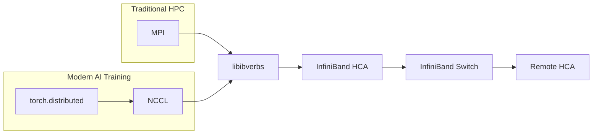
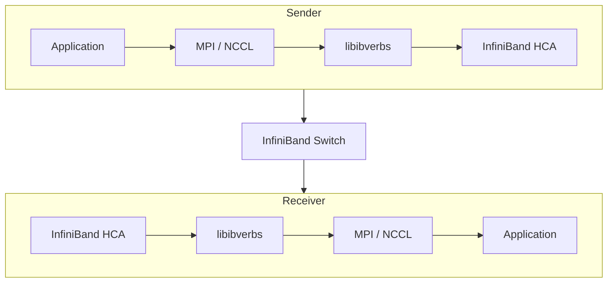

🔍 **OpenSM configures the network. MPI uses the network.**

> In the previous post, we learned that OpenSM is responsible for discovering an InfiniBand fabric, assigning Local IDs (LIDs), configuring routes, and bringing the subnet online.
>
> But OpenSM itself never transfers application data.
> The actual communication is performed by MPI over the network that OpenSM has already configured.

---
## ① Where Does MPI Fit?

A common misconception is that OpenSM participates in every communication. It does not. OpenSM configures the InfiniBand fabric during initialization, but once the subnet is ready, application traffic flows directly between HCAs using RDMA.

Traditional HPC applications typically use `MPI`, whereas modern AI frameworks use `torch.distributed` with `NCCL`. Although the communication libraries differ, both ultimately rely on the same InfiniBand transport.

From OpenSM's perspective, there is little difference between an MPI application and a modern AI workload. Its responsibility ends after configuring the subnet, while runtime communication is performed directly by the HCAs over the InfiniBand fabric.

---

## ② Responsibilities

Each component is responsible for a different layer of the communication stack.

| Component | Responsibility |
|-----------|----------------|
| OpenSM | Discover the subnet, assign LIDs, and compute routing tables |
| HCA | Execute RDMA operations and transfer packets |
| InfiniBand Switch | Forward packets according to forwarding tables |
| MPI / NCCL | Provide high-performance communication APIs for distributed applications |

OpenSM `prepares` the InfiniBand fabric before communication begins. MPI and NCCL `use` the configured fabric to exchange data during application runtime.

---

## ③ What Happens During Communication?

Whether an application uses `MPI` or `NCCL`, the communication eventually follows the same InfiniBand transport path. The communication library issues RDMA operations through `libibverbs`, and the HCAs exchange packets over the InfiniBand fabric.

Notice that OpenSM is not part of the communication path. Its work has already been completed before any application begins exchanging data.

---

## ④ Why Is OpenSM Required?

Without OpenSM, an InfiniBand subnet cannot become operational.

- HCAs have no valid LIDs.
- Switches have no forwarding tables.
- No communication path exists between nodes.

As a result, neither MPI nor NCCL can exchange data.

OpenSM prepares the InfiniBand fabric before any communication library begins sending messages.

---

## ⑤ Does OpenSM Handle Every Packet?

No.

After initialization:

* OpenSM is not involved in packet forwarding.
* MPI traffic bypasses OpenSM completely.
* Switch ASICs forward packets entirely in hardware.
* HCAs perform RDMA directly.

This separation is one of the reasons InfiniBand achieves extremely low latency.

---

## Summary

OpenSM and MPI complement each other but serve different purposes.

* OpenSM manages the network.
* MPI manages distributed communication.
* HCAs execute RDMA.
* Switches forward packets in hardware.

Understanding this distinction is essential before exploring RDMA verbs and queue pairs.

In the next post, we'll dive into the InfiniBand Verbs API, where MPI eventually reaches the hardware through Queue Pairs (QPs), Completion Queues (CQs), and Work Queue Elements (WQEs).
