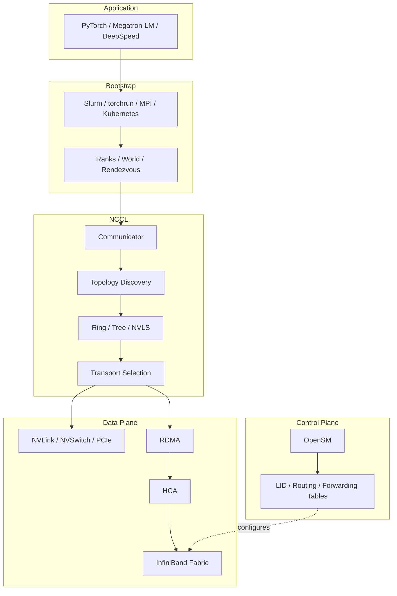
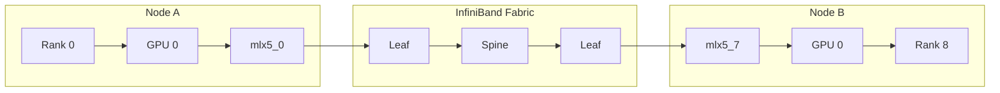

🔍**Understanding Modern distributed GPU communication.**
> Distributed GPU training is often described as a single communication stack, but it is actually composed of several independent layers. A launcher such as `Slurm`, `torchrun`, or `MPI` first creates the distributed world. 
>
> NCCL then discovers the system topology and plans GPU communication, while RDMA-capable HCAs transfer data across an InfiniBand fabric that has already been configured by a Subnet Manager such as OpenSM. 
>
> Although these components appear together in every distributed training job, each is responsible for a completely different part of the communication pipeline.

---

## ① The Distributed GPU Communication Stack



Although these components appear in the same execution path, they do not perform the same work.

| Layer | Responsibility |
|--------|----------------|
| Slurm / `torchrun` / MPI | Launch processes, assign ranks, and establish the distributed world |
| NCCL | Create communicators, discover topology, and select collective algorithms and transports |
| RDMA / HCA | Transfer data between communication endpoints |
| OpenSM | Configure the InfiniBand subnet before runtime |
| InfiniBand Switch ASIC | Forward packets using installed forwarding tables |

The most important distinction is that bootstrap, communication planning, network configuration, and packet forwarding are separate responsibilities handled by different software and hardware components.

---

## ② Bootstrap: Building the Distributed World

Before NCCL can exchange a single tensor, every participating process must first discover the others. This initialization phase is commonly called **bootstrap** or **rendezvous**. Bootstrap establishes the distributed world by launching processes, assigning global and local ranks, determining the world size, and exchanging the information required to initialize NCCL.

Several different launchers can perform this task.

| Launcher | Typical Environment |
|----------|---------------------|
| `torchrun` | PyTorch Distributed |
| `srun` | Slurm clusters |
| `mpirun` | Traditional HPC |
| Kubernetes | Cloud-native training |

Although the implementations differ, they all perform essentially the same responsibility: they create the distributed process group. They do not perform GPU communication.

A typical modern AI training stack therefore looks like:

```text
Slurm → srun →torchrun
    ↓
ProcessGroupNCCL → NCCL
```

Historically, many HPC applications instead used:

```text
mpirun → Processes & Ranks → Bootstrap
```

From NCCL's perspective, however, the launcher is largely irrelevant. Once bootstrap has completed successfully, NCCL receives the information required to initialize its communicator.

---

## ③ Does NCCL Require MPI?

No. MPI is one possible bootstrap mechanism, but it is **not** a dependency of NCCL. Modern PyTorch training typically relies on `torchrun` together with a rendezvous backend such as TCPStore to exchange bootstrap information before ProcessGroupNCCL initializes NCCL. Whether the launcher is MPI, Slurm, or Kubernetes, NCCL performs exactly the same initialization procedure after bootstrap completes.

This distinction is often overlooked because many traditional HPC diagrams combine bootstrap and communication into a single MPI layer. In reality, bootstrap answers the question **"Who participates?"**, while NCCL answers **"How should these GPUs communicate?"**

---

## ④ What Does NCCL Actually Do?

After bootstrap, NCCL creates a communicator for every participating GPU. During communicator initialization it discovers the GPU topology, PCIe hierarchy, NVLink and NVSwitch connectivity, NUMA topology, available HCAs, network interfaces, and GPU–NIC affinity. Using this information, NCCL constructs a logical communication topology and selects the most efficient communication algorithm and transport.

For communication inside a node, NCCL may use NVLink, NVSwitch, or PCIe peer-to-peer. For communication across nodes, it may use InfiniBand RDMA, RoCE, NCCL network plugins, or TCP sockets depending on the available hardware and configuration. NCCL also selects collective algorithms such as Ring, Tree, NVLS, or CollNet according to the detected topology.

Importantly, the communication topology created by NCCL is a **logical topology between ranks**, not the physical routing path through the InfiniBand network.

---

## ⑤ Who Decides the Communication Path?

Suppose Rank 0 running on Node A must exchange data with Rank 8 on Node B.



NCCL determines that Rank 0 should communicate with Rank 8, selects the local HCA, identifies the remote communication endpoint, creates the required communication channels, and chooses the collective algorithm. It does **not** determine the physical packet route through the InfiniBand fabric.

Instead, RDMA transports establish the required communication resources, while the network itself forwards packets according to forwarding tables that were installed earlier by the active Subnet Manager.

---

## ⑥ What Does OpenSM Do?

OpenSM is an InfiniBand Subnet Manager. Before any application begins communicating, it discovers HCAs and switches, assigns Local IDs (LIDs), computes routes, programs forwarding tables, and brings the subnet into an operational state.

Once this initialization is complete, OpenSM's work is largely finished. During application execution, packet forwarding is performed entirely by switch ASICs using the previously installed forwarding state. OpenSM is therefore part of the **control plane**, not the **data plane**.

This is why OpenSM does not receive every packet, execute NCCL collectives, or copy application data. Its responsibility is to prepare the fabric before communication begins.

---

## ⑦ Control Plane vs Data Plane

The relationship between NCCL and OpenSM becomes much clearer when separating the control plane from the data plane.

```text
Control Plane(OpenSM) 
    ↓
Fabric Discovery
    ↓
LID Assignment
    ↓
Route Computation
    ↓
Forwarding Tables
```

```text
Data Plane → GPU → NCCL(RDMA) → HCA
    ↓
InfiniBand Switch ASIC
    ↓
Remote HCA → Remote GPU
```

The control plane prepares the network, while the data plane transfers tensors. Because forwarding decisions have already been installed, switches can forward packets entirely in hardware without consulting OpenSM during communication.

---

## Summary

- Modern distributed GPU communication consists of several independent layers working together. 
- Slurm, `torchrun`, MPI, or Kubernetes establishes the distributed world through bootstrap. NCCL then creates GPU communicators, discovers the hardware topology, and selects collective algorithms and communication transports. 
- RDMA-capable `HCAs` move data between communication endpoints, while OpenSM prepares the InfiniBand subnet before runtime by configuring routing information and forwarding tables. 
- Once communication begins, InfiniBand switch ASICs forward packets entirely in hardware. 
- Understanding this separation between bootstrap, communication planning, data transfer, and network control provides the foundation for understanding lower-level RDMA concepts such as Queue Pairs, Memory Regions, Work Requests, and Completion Queues.