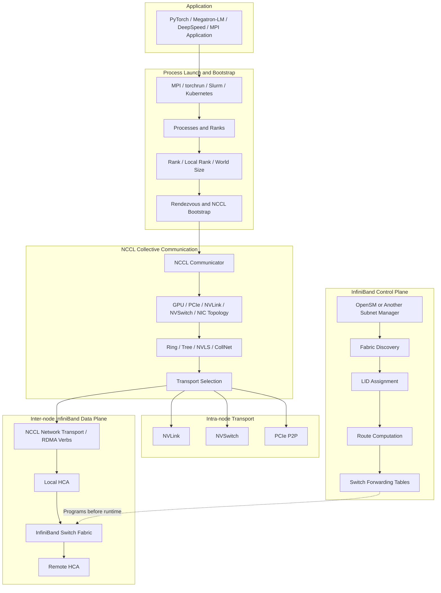
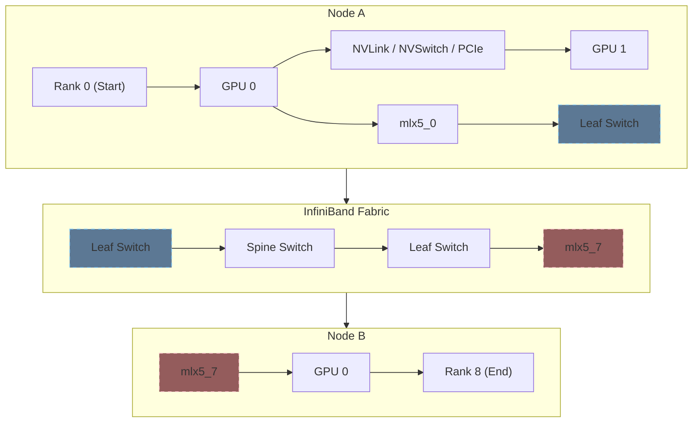
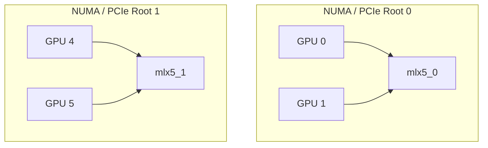
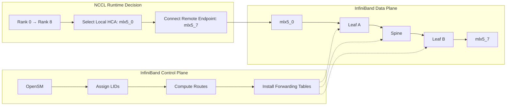
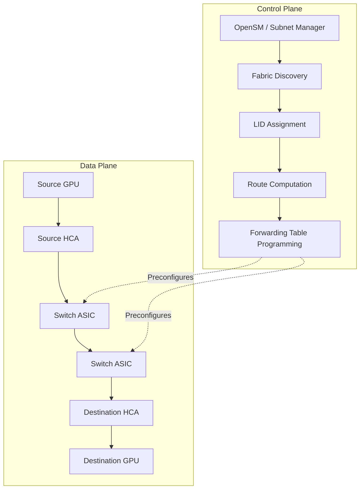
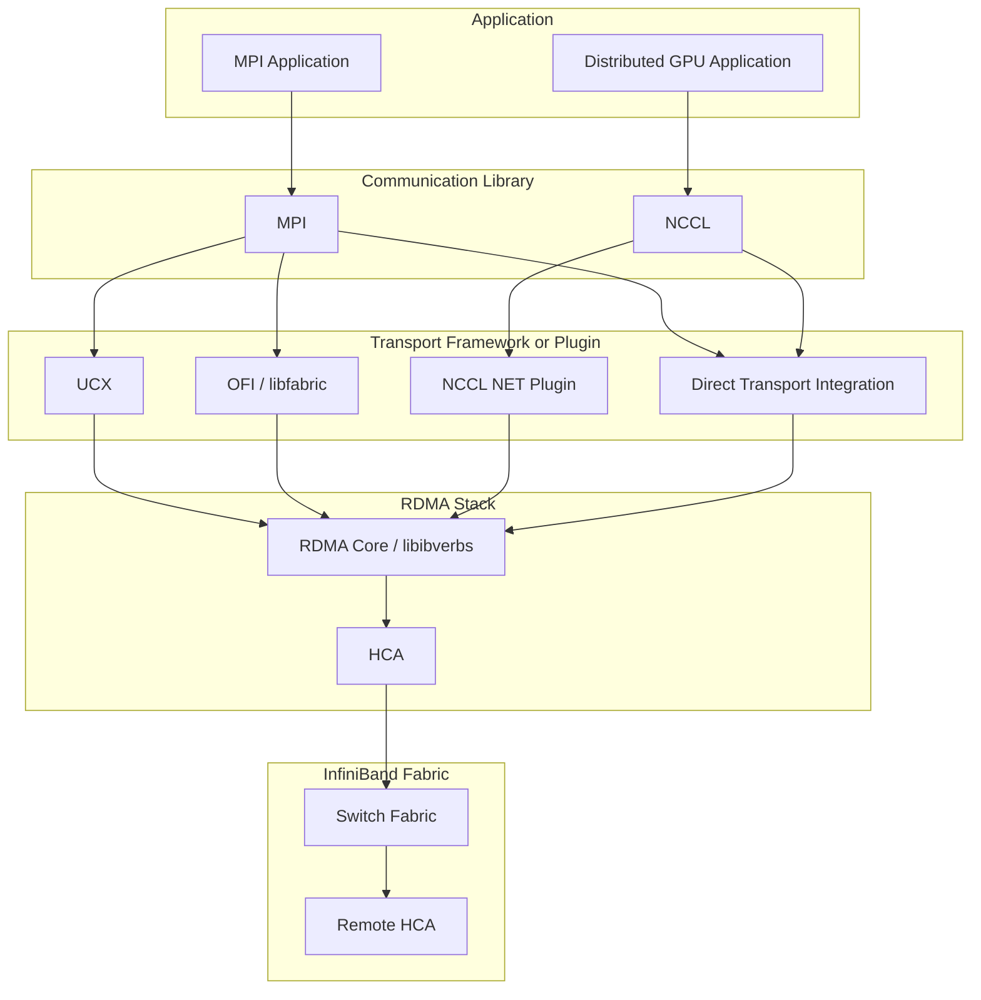
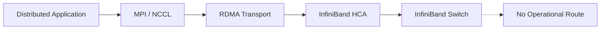
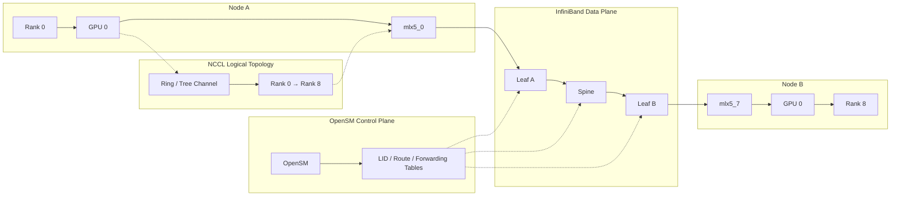

🔍 **MPI or `torchrun` builds the distributed world. NCCL selects the GPU communication path. OpenSM configures the InfiniBand fabric.**

> In the previous post, we learned that an InfiniBand Subnet Manager discovers fabric devices, assigns Local IDs (LIDs), computes routes, programs switch forwarding tables, and brings the subnet online.
>
> OpenSM does not transfer application data and does not participate in every packet exchange.
>
> In distributed GPU training, MPI or `torchrun` creates processes and ranks, NCCL selects collective algorithms and communication transports, and RDMA-capable HCAs and InfiniBand switches transfer the actual data over the fabric configured by OpenSM.

---

## ① The Distributed GPU Communication Stack

A distributed GPU training job consists of multiple layers with separate responsibilities. MPI, `torchrun`, Slurm, or Kubernetes starts processes and provides rank, world size, and rendezvous information. NCCL creates GPU communicators, discovers GPU and NIC topology, and selects collective algorithms and transports. If communication crosses node boundaries, NCCL uses a network transport such as InfiniBand RDMA through an HCA. The InfiniBand fabric must already have been initialized by an active Subnet Manager such as OpenSM.



The important distinction is that these components do not perform the same task.

| Layer                                 | Responsibility                                                                                                             |
| ------------------------------------- | -------------------------------------------------------------------------------------------------------------------------- |
| MPI / `torchrun` / Slurm / Kubernetes | Launch processes, assign ranks, define world membership, and provide bootstrap or rendezvous                               |
| NCCL                                  | Create GPU communicators, discover GPU and NIC topology, select collective algorithms, and choose communication transports |
| RDMA transport / HCA                  | Execute DMA and network operations and transfer data between endpoints                                                     |
| OpenSM or another Subnet Manager      | Configure the InfiniBand subnet, assign LIDs, compute routes, and program forwarding tables                                |
| InfiniBand switch ASIC                | Forward packets in hardware according to the installed forwarding state                                                    |

---

## ② Is MPI Required for NCCL?

No. MPI is not a mandatory dependency of NCCL. Traditional HPC applications commonly use MPI for process launch, rank assignment, and application communication.

```text
mpirun → MPI Processes and Ranks → MPI Communication
  ↓
InfiniBand
```

MPI can also be used only as a launcher and bootstrap mechanism for NCCL.

```text
mpirun → MPI Processes and Ranks
  ↓
NCCL Unique ID Exchange → NCCL Communicators
  ↓
GPU Collectives
```

Modern AI frameworks commonly use `torchrun` instead of MPI.

```text
torchrun → PyTorch Processes and Ranks
  ↓
TCPStore / Rendezvous
  ↓
ProcessGroupNCCL → NCCL
  ↓
NVLink / NVSwitch / PCIe / InfiniBand
```

For example:

```bash
torchrun \
  --nnodes=8 \
  --nproc-per-node=8 \
  --node-rank="${NODE_RANK}" \
  --master-addr="${MASTER_ADDR}" \
  --master-port=29500 \
  train.py
```

`torchrun` provides distributed execution metadata such as `RANK`, `LOCAL_RANK`, `WORLD_SIZE`, and rendezvous information. NCCL then creates communicators for the GPUs associated with those processes. MPI is therefore one possible launcher and bootstrap mechanism, but it is not required for NCCL-based distributed training.
MPI is also not normally installed automatically with NVIDIA GPU drivers, CUDA Toolkit, `libnccl`, or PyTorch. If MPI is required, an implementation such as Open MPI, MPICH, or Intel MPI is normally installed separately or provided through an HPC software stack or container image.

---

## ③ What Does NCCL Know?

NCCL is topology-aware. It does not see only abstract ranks. During communicator initialization, NCCL discovers GPUs, PCIe hierarchy, NVLink connections, NVSwitch topology, CPU and NUMA topology, network interfaces, InfiniBand or RoCE HCAs, and GPU-to-NIC affinity. NCCL uses this information to decide how data should move between ranks.



For intra-node communication, NCCL may use NVLink, NVSwitch, PCIe peer-to-peer, or shared-memory-related paths. For inter-node communication, NCCL may use InfiniBand, RoCE, NCCL network plugins, or TCP sockets. NCCL also selects logical collective algorithms such as Ring, Tree, NVLS, and CollNet.
The NCCL collective topology is a logical communication graph between ranks. It is not the same as the physical routing path through InfiniBand switches.

---

## ④ Does NCCL Know the NIC?

Yes. NCCL can discover and select network interfaces and HCAs. Consider a node with multiple GPUs and HCAs:

```text
GPU 0 ─ PCIe Root 0 ─ mlx5_0
GPU 1 ─ PCIe Root 0 ─ mlx5_0
GPU 4 ─ PCIe Root 1 ─ mlx5_1
GPU 5 ─ PCIe Root 1 ─ mlx5_1
```

NCCL evaluates GPU-to-NIC affinity and attempts to select an appropriate HCA for each communication channel.



This is commonly described as **GPU-NIC affinity**. Selecting a nearby NIC can reduce cross-socket, cross-NUMA, and cross-root-complex traffic.

```text
# Preferred:
GPU 0 → mlx5_0

# Less desirable:
GPU 0 → Remote NUMA Node → mlx5_1
```

However, selecting an HCA does not mean that NCCL controls every InfiniBand switch hop between the local and remote HCAs.

## ⑤ Who Selects the Destination?

NCCL determines the logical communication peer. For example, NCCL may construct a Ring such as:

```text
Rank 0 → Rank 1 → Rank 2 → Rank 3 → Rank 0
```

If Rank 0 and Rank 1 are on different nodes, NCCL and its network transport establish communication between their network endpoints.

```text
Rank 0 / GPU 0
  ↓
Local HCA: mlx5_0
  ↓
Remote Endpoint: mlx5_7
  ↓
Rank 1 / Remote GPU
```

NCCL decides which rank communicates with which rank, which GPU participates, which local HCA or network interface is used, which remote endpoint the transport connects to, how many channels are created, and which collective algorithm is used.
The transport layer then establishes communication resources such as Queue Pairs, registered memory regions, Completion Queues, Work Requests, and transport-specific connection metadata. NCCL selects endpoints and communication topology, but it does not program individual InfiniBand switch forwarding entries for each collective operation.

---

## ⑥ What Does OpenSM Decide?

OpenSM operates as an InfiniBand Subnet Manager. Its responsibilities include discovering HCAs, switches, and ports; assigning Local IDs; computing paths; programming switch forwarding tables; configuring subnet parameters; monitoring subnet state; and bringing the subnet into an operational state.
Suppose NCCL communication must flow from:

```text
Local HCA: mlx5_0
  ↓
Remote HCA: mlx5_7
```

The physical path may traverse:

```text
mlx5_0
  ↓
Leaf Switch A
  ↓
Spine Switch B
  ↓
Leaf Switch C
  ↓
mlx5_7
```

The internal switch path is based on routing and forwarding state installed by the active Subnet Manager.



NCCL effectively decides:

> Communicate with this remote rank through this network endpoint.
> OpenSM has already configured the fabric so that packets addressed to that destination can be transmitted across the switch fabric. OpenSM does not normally receive every packet, forward application data, or execute NCCL collectives.

---

## ⑦ Control Plane and Data Plane

The difference between OpenSM and NCCL becomes clearer when separating the control plane and data plane.



The control plane prepares the network:

```text
OpenSM or Another Subnet Manager
  ↓
Fabric Discovery
  ↓
LID Assignment
  ↓
Route Computation
  ↓
Switch Forwarding Table Programming
```

The data plane transfers application traffic:

```text
GPU
  ↓
NCCL Transport
  ↓
Local HCA
  ↓
InfiniBand Switch ASICs
  ↓
Remote HCA
  ↓
Remote GPU
```

## Switch ASICs perform packet forwarding in hardware. OpenSM defines and installs the forwarding state, but the switches apply that state without consulting OpenSM for every packet. This separation allows InfiniBand to achieve low and predictable network latency.

## ⑧ What Happens During NCCL Communication?

Consider an inter-node NCCL AllReduce.

### Step 1: Process Launch

MPI, `torchrun`, Slurm, Kubernetes, or another launcher starts the training processes. Each process receives a global rank, local rank, world size, and rendezvous information.

### Step 2: NCCL Bootstrap

Processes exchange NCCL communicator bootstrap information through MPI broadcast, PyTorch TCPStore, a rendezvous service, socket communication, or framework-specific orchestration.

### Step 3: Topology Discovery

NCCL discovers GPUs, NVLink and NVSwitch topology, PCIe topology, NICs and HCAs, and GPU-NIC affinity.

### Step 4: Collective Planning

NCCL builds communication channels and selects algorithms such as Ring or Tree.

### Step 5: Transport Selection

```text
Same Node
├─ NVLink
├─ NVSwitch
├─ PCIe P2P
└─ Shared Memory Transport

Different Node
├─ InfiniBand RDMA
├─ RoCE
├─ NCCL Network Plugin
└─ TCP Socket Fallback
```

### Step 6: RDMA Execution

For an InfiniBand path, the transport and HCA execute communication through RDMA resources.

### Step 7: Hardware Forwarding

## InfiniBand switches forward packets according to the forwarding tables previously installed by the Subnet Manager. OpenSM is not synchronously involved in each collective or packet exchange.

## ⑨ Is `MPI / NCCL → libibverbs` Always Exact?

A simplified diagram often looks like this:

```text
MPI / NCCL
  ↓
libibverbs
  ↓
HCA
```

This is useful as a high-level model, but actual software stacks may contain additional layers. MPI implementations may use UCX, OFI/libfabric, direct Verbs, shared memory, or TCP. NCCL may use its internal InfiniBand transport, NCCL NET plugins, vendor network plugins, RDMA Verbs, or TCP sockets.
A more general representation is:



## The exact stack depends on the MPI implementation, NCCL build, network plugin, system configuration, and selected transport.

## ⑩ Why Is a Subnet Manager Required?

An InfiniBand subnet requires an active Subnet Manager. OpenSM is one commonly used implementation, but it is not the only possible implementation. Some environments use an embedded Subnet Manager on a switch or a vendor-provided management stack.
Without an active Subnet Manager:

* Ports may not reach the active state.
* HCAs may not receive valid LIDs.
* Switches may not have forwarding tables.
* Paths between endpoints may not be available.
* MPI and NCCL cannot normally use the InfiniBand fabric.



The precise statement is:

> An InfiniBand subnet requires an active Subnet Manager, such as OpenSM, before distributed applications can communicate through the fabric.
> This is more accurate than claiming that every InfiniBand deployment specifically requires the OpenSM implementation.

---

## ⑪ Who Decides What?

| Component                             | Primary Responsibility                                                                                                     |
| ------------------------------------- | -------------------------------------------------------------------------------------------------------------------------- |
| MPI / `torchrun` / Slurm / Kubernetes | Start processes, assign ranks, define world membership, and provide bootstrap or rendezvous                                |
| `torch.distributed`                   | Expose distributed APIs and manage process groups in PyTorch                                                               |
| NCCL                                  | Create GPU communicators, discover GPU and NIC topology, select collective algorithms, and choose communication transports |
| NCCL network transport or plugin      | Establish network connections and transfer NCCL data between nodes                                                         |
| RDMA Verbs / UCX / OFI                | Provide transport primitives such as Queue Pairs, memory registration, and Work Requests                                   |
| HCA                                   | Execute DMA and network operations and transmit or receive packets                                                         |
| OpenSM or another Subnet Manager      | Discover and configure the InfiniBand subnet, assign LIDs, compute routes, and program forwarding tables                   |
| InfiniBand switch ASIC                | Forward packets in hardware according to the installed forwarding state                                                    |
| A compact mental model is:            |                                                                                                                            |

```text
MPI / torchrun
→ Who are the processes and ranks?

NCCL
→ Which GPUs communicate, using which collective algorithm and transport?

RDMA Transport / HCA
→ How are bytes transferred between network endpoints?

OpenSM
→ How is the InfiniBand subnet configured before runtime?

InfiniBand Switch ASIC
→ Which output port should each packet use?
```

---

## ⑫ End-to-End Example

Assume an eight-node cluster with eight GPUs per node. Rank 0 runs on GPU 0 of Node A, and Rank 8 runs on GPU 0 of Node B.



The responsibility chain is:

1. MPI or `torchrun` creates Rank 0 and Rank 8.
2. The framework exchanges NCCL bootstrap information.
3. NCCL discovers the topology of both nodes.
4. NCCL decides that Rank 0 must communicate with Rank 8.
5. NCCL selects `mlx5_0` on Node A and a remote network endpoint on Node B.
6. The RDMA transport creates and uses the required communication resources.
7. The source HCA transmits packets.
8. InfiniBand switches forward packets using tables installed by the Subnet Manager.
9. The destination HCA receives the data and makes it available to the destination GPU.
10. NCCL advances the collective operation.
    At no point does OpenSM copy the tensor, execute the collective, or process each packet in software.

---

## Summary

Modern distributed GPU communication is composed of multiple independent layers:

* MPI, `torchrun`, Slurm, or Kubernetes establishes processes, ranks, and the distributed world.
* NCCL creates GPU communicators and selects collective algorithms and communication transports.
* NCCL understands GPUs, NVLink, NVSwitch, PCIe, NICs, HCAs, and GPU-NIC affinity.
* For intra-node communication, NCCL may use NVLink, NVSwitch, or PCIe.
* For inter-node communication, NCCL may use InfiniBand, RoCE, network plugins, or sockets.
* NCCL selects communication peers and network endpoints but does not program each InfiniBand switch hop.
* RDMA transports and HCAs perform the actual data movement.
* OpenSM or another Subnet Manager configures the InfiniBand subnet before runtime.
* InfiniBand switch ASICs forward packets in hardware according to the installed forwarding tables.
* MPI is not required for NCCL. Modern PyTorch training commonly uses `torchrun` and `ProcessGroupNCCL`.
* NVIDIA drivers, CUDA, and NCCL do not normally install MPI automatically.
  The complete conceptual stack is:

```text
Distributed Application
  ↓
MPI / torchrun / Slurm / Kubernetes
  ↓
Processes / Ranks / World / Bootstrap
  ↓
torch.distributed / NCCL
  ↓
Ring / Tree / Transport Selection
  ↓
NVLink / NVSwitch / PCIe
  or
RDMA Transport / HCA
  ↓
InfiniBand Fabric
  ↓
Switch Forwarding State Configured by OpenSM
```

Understanding this separation is essential before examining the InfiniBand Verbs API. In the next post, we will follow the network data path through Queue Pairs, Completion Queues, Memory Regions, Work Requests, and Work Queue Elements.
