🔍 **Following a PyTorch Program from Python to GPU Execution**

> A Transformer model is usually written as ordinary Python code, but its execution eventually becomes a sequence of optimized CPU or GPU kernels. PyTorch 2.x connects these layers through `torch.compile`, TorchDynamo, FX graphs, AOTAutograd, operator decomposition, TorchInductor, and backend-specific code generation. This post provides a high-level map of that compilation pipeline before examining each component in detail.

---

## ① The Compilation Pipeline

A PyTorch model normally executes in eager mode. Each Python operation immediately dispatches one or more PyTorch operators, which eventually launch kernels on the target device. This execution model is flexible and easy to debug, but the runtime sees only a small part of the program at a time, limiting opportunities such as operator fusion, memory planning, and kernel specialization.

```python
outputs = model(inputs)
loss = criterion(outputs, labels)
loss.backward()
```

With `torch.compile`, PyTorch attempts to capture larger regions of the program and transform them into optimized executable code.

```python
compiled_model = torch.compile(model)
outputs = compiled_model(inputs)
```

The overall flow can be summarized as follows.

```mermaid
flowchart LR
    PY["Python Program"]
    DYNAMO["TorchDynamo"]
    FX["FX Graph"]
    AOT["AOTAutograd"]
    DECOMP["ATen Decomposition"]
    INDUCTOR["TorchInductor"]
    CODEGEN["Triton or C++"]
    RUNTIME["CUDA or CPU Runtime"]
    DEVICE["GPU or CPU"]

    PY --> DYNAMO
    DYNAMO --> FX
    FX --> AOT
    AOT --> DECOMP
    DECOMP --> INDUCTOR
    INDUCTOR --> CODEGEN
    CODEGEN --> RUNTIME
    RUNTIME --> DEVICE
```

*Figure 1. From Python to GPU Kernels.*


This diagram is useful as a conceptual map, but the implementation is not always a single rigid sequence. Inference may not require a backward graph, graph breaks may divide one Python function into multiple compiled regions, and different backends can replace TorchInductor. The default `torch.compile` path, however, generally follows this structure.

---

## ② TorchDynamo — Capturing Python Execution

TorchDynamo is the frontend of `torch.compile`. Rather than requiring the user to rewrite the model in a separate graph language, Dynamo observes ordinary Python execution and extracts PyTorch operations into graph regions.

Dynamo integrates with CPython frame evaluation and interprets Python bytecode before normal execution. When it encounters operations that can be represented safely, it records them into an FX graph. Python behavior that cannot be captured may cause a graph break.

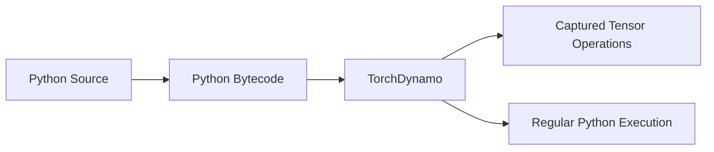

Consider a simple function.

```python
def transform(x, bias):
    y = x + bias
    y = torch.relu(y)
    return y * 2
```

Dynamo does not primarily compile the source text itself. It observes the bytecode-level execution and captures the tensor operations that occur while the function runs.

The captured region is guarded by assumptions about the execution environment. These assumptions may include tensor dtype, device, rank, shape properties, Python object identity, or module attributes. When a later invocation still satisfies the guards, PyTorch can reuse the compiled result. When a guard fails, PyTorch may compile another specialization.

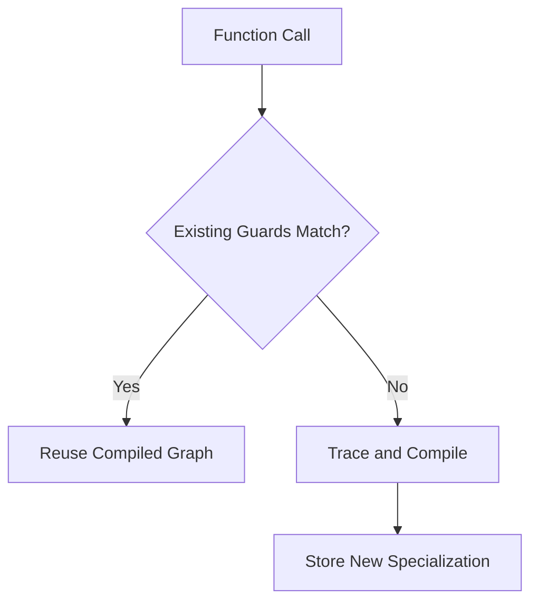

Dynamo therefore performs more than graph extraction. It also preserves Python semantics by tracking the assumptions under which the captured graph remains valid.

---

## ③ FX Graph — The Captured Program

The result of Dynamo tracing is represented using PyTorch FX. FX provides a graph-based intermediate representation composed of nodes such as placeholders, function calls, method calls, module calls, and outputs.

The previous Python function may conceptually become a graph similar to this.

```text
placeholder  x
placeholder  bias
call_function  add
call_function  relu
call_function  mul
output
```

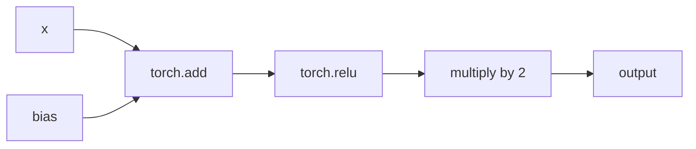

The FX graph is not yet a GPU kernel. It is an intermediate representation describing tensor operations and their data dependencies. Compiler components can analyze this representation without repeatedly interpreting the original Python source.

At this level, the system can reason about questions that are difficult to answer from isolated eager operations:

- Which operators depend on each other?
- Which intermediate tensors are consumed only once?
- Which operations can be fused?
- Which values must be materialized in memory?
- Which dimensions are static or symbolic?
- Which operations belong to the forward or backward computation?

The graph is therefore the boundary between flexible Python execution and compiler-oriented optimization.

---

## ④ FakeTensor and Symbolic Shapes

Graph capture and compilation should not need to allocate every real tensor produced by the model. PyTorch uses FakeTensor-based execution to propagate metadata such as shape, dtype, stride, layout, and device without performing the full numerical computation.

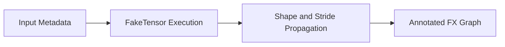

For example, the compiler may need to know that a matrix multiplication produces a tensor with shape `[batch, sequence, hidden]`, but it does not need to calculate the actual values while constructing the graph.

Dynamic dimensions can be represented using symbolic values rather than fixed integers. This allows one compiled graph to support multiple compatible input sizes when its guards and generated code permit it.

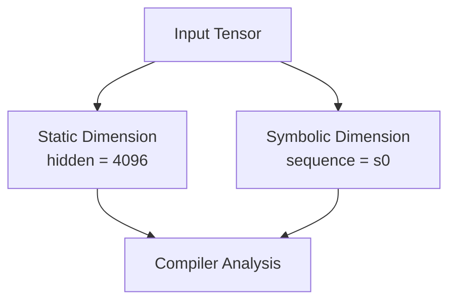

Symbolic shapes improve generality, but they also increase compiler complexity. Operations may introduce constraints on symbolic dimensions, and a change outside the supported assumptions can still trigger recompilation.

---

## ⑤ AOTAutograd — Exposing the Backward Graph

Dynamo can capture the forward execution, but training also requires gradient computation. In eager mode, Autograd records operations during the forward pass and dynamically executes backward functions when `backward()` is called.

AOTAutograd transforms this process by tracing differentiable computation ahead of backward execution. It produces compiler-visible forward and backward graphs that can both be optimized.

Conceptually, eager training behaves as follows.

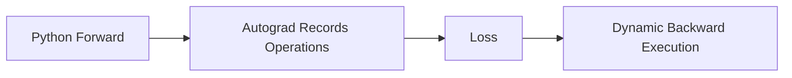

With AOTAutograd, a larger portion of the gradient computation becomes an explicit graph.

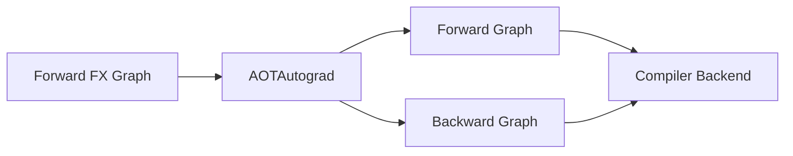

This separation gives the backend visibility into operations that would otherwise be created dynamically by Autograd. It enables optimization of both forward and backward computation, although graph breaks, hooks, custom autograd behavior, mutations, and aliasing can affect how much of the backward path is captured.

AOTAutograd should not be confused with AOTInductor. AOTAutograd exposes forward and backward graphs for compilation, while AOTInductor produces deployable compiled artifacts ahead of runtime from exported models.

---

## ⑥ Operator Decomposition and PrimTorch

PyTorch exposes a large operator surface. High-level operations such as normalization, activation, indexing, or composite loss functions may internally represent combinations of simpler operations.

Supporting every high-level operator independently would make compiler backends unnecessarily complex. PyTorch therefore decomposes many operations into a smaller and more regular operator set, commonly based on ATen operators and primitive operations.

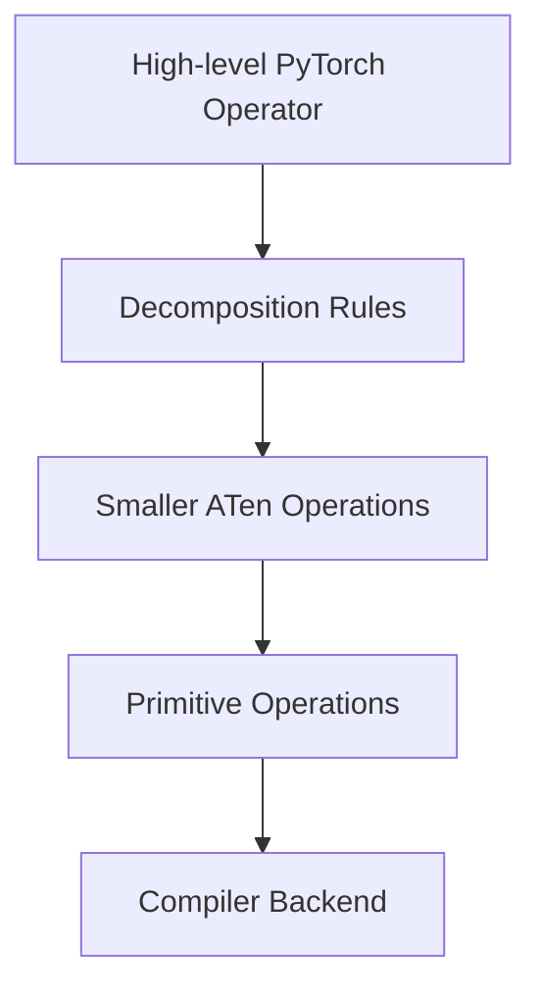

A conceptual normalization operation may be decomposed as follows.

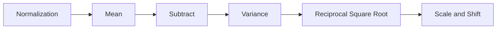

PrimTorch refers to the effort to reduce PyTorch's broad operator set into a smaller set of primitive operations that backend developers can target. It is better understood as an operator normalization and decomposition layer than as a standalone compiler executable that every graph passes through in one isolated step.

The important idea is that TorchInductor receives a graph expressed in an operator vocabulary it can lower and optimize effectively.

---

## ⑦ TorchInductor — Lowering and Optimization

TorchInductor is the default backend used by `torch.compile`. It consumes FX graphs, lowers their operators into its internal representations, analyzes data dependencies, plans loop execution, performs fusion, and generates target-specific code.

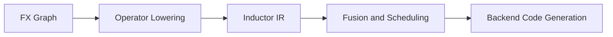

A major optimization opportunity is kernel fusion. In eager mode, a chain of elementwise operations may launch separate kernels and write intermediate results to global memory after every step.

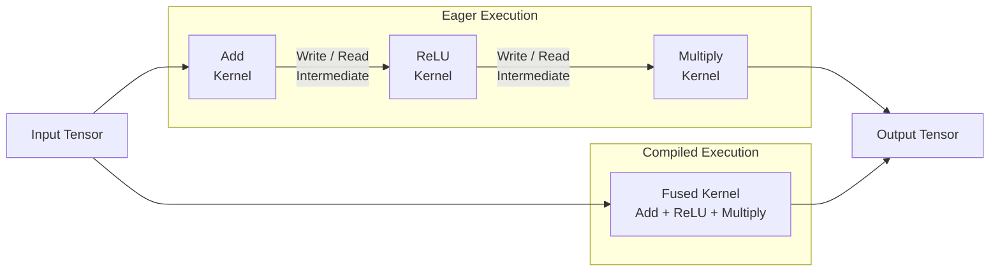

When the operations are compatible, Inductor can generate a fused loop or GPU kernel that computes the same result without materializing every intermediate tensor.

This can reduce:

- Kernel launch overhead
- Intermediate memory allocation
- Global memory reads and writes
- Python dispatch overhead
- Synchronization between individual eager operations

Fusion is not always possible or profitable. Tensor layouts, mutation, aliasing, reductions, device boundaries, unsupported operations, and scheduling constraints can divide the graph into multiple kernels.

---

## ⑧ Triton and Target-specific Code Generation

After optimization, Inductor generates code for the target device. For GPU workloads, Triton is a major code-generation path used to produce specialized GPU kernels. CPU graphs commonly use generated C++ code.

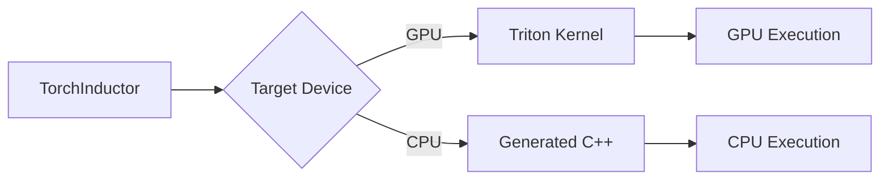

Triton provides a Python-based language and compiler for expressing blocked parallel computations. TorchInductor can generate Triton programs specialized for tensor shapes, layouts, dtypes, and hardware properties.

The Triton compiler then lowers the program through lower-level compiler representations until executable GPU code is produced.

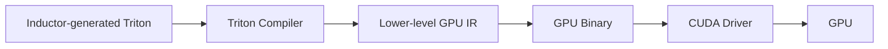

Triton is therefore not the component that captures Python or creates the Autograd graph. It operates near the lower end of the pipeline, where compiler-visible tensor computations are converted into executable GPU kernels.

---

## ⑨ Runtime Execution and Caching

Compilation does not occur on every operation. During the first invocation of a compiled region, PyTorch traces the program, creates graphs, runs compiler passes, generates code, and compiles the backend kernel. This makes the first execution slower than steady-state execution.

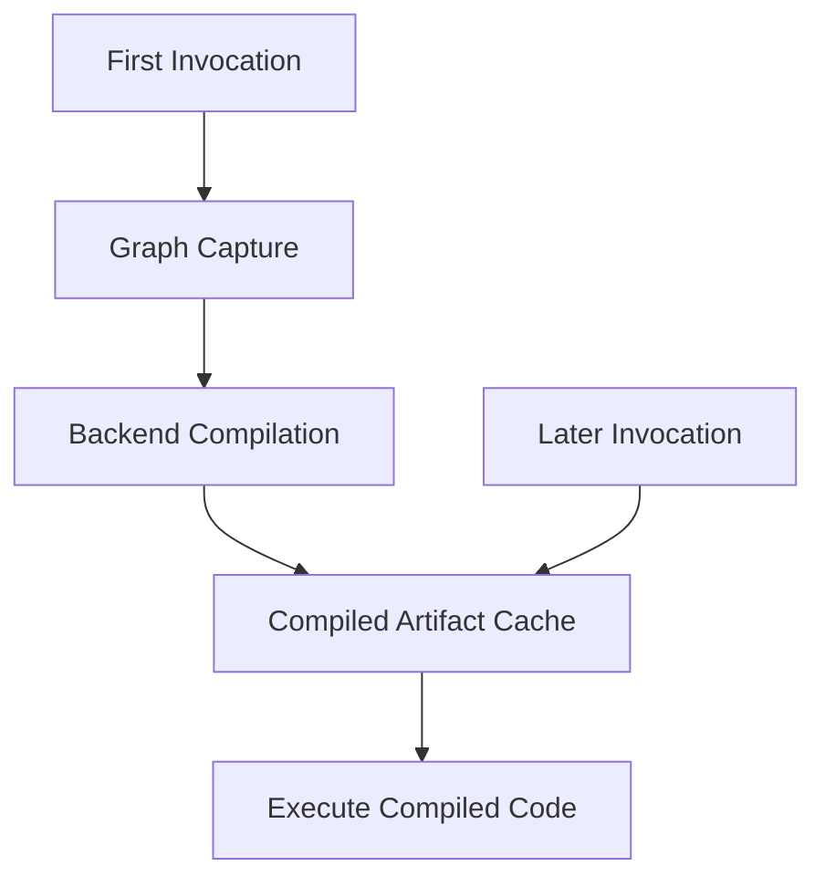

Later calls can reuse the cached result while the associated guards remain valid. A guard failure, unsupported input variation, or graph change may cause recompilation.

This creates two performance phases:

- **Compilation phase:** tracing, lowering, code generation, compilation, and autotuning
- **Steady-state phase:** repeated execution of cached compiled kernels

Benchmarks must separate these phases. Measuring only the first iteration can make compiled execution appear slower even when its steady-state throughput is higher.

---

## ⑩ Graph Breaks

Dynamo cannot always represent an entire Python function as one FX graph. Unsupported Python behavior, data-dependent control flow, calls into unsupported libraries, explicit graph-breaking APIs, or values that must be materialized in Python can interrupt graph capture.

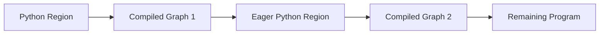

Execution remains correct because PyTorch can return to eager mode and resume graph capture later. However, excessive graph breaks reduce optimization scope and introduce transitions between compiled and eager execution.

A graph break does not necessarily mean that `torch.compile` has completely failed. It means that one continuous graph was divided into smaller regions.

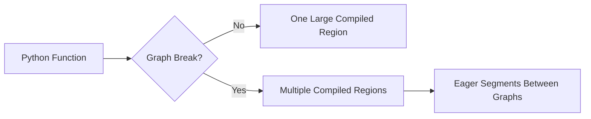

Graph-break analysis is therefore one of the first steps when compiled performance does not match expectations.

---

## ⑪ What Happens to a Transformer Model?

A Transformer contains matrix multiplications, normalization, attention, activation functions, indexing, communication operations, and loss computation. Under eager execution, these operations are dispatched individually or through pre-existing fused kernels.

With `torch.compile`, compatible regions can be captured and compiled together.

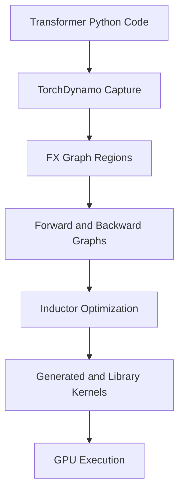

Not every Transformer operation necessarily becomes a newly generated Triton kernel. The final execution may contain a combination of:

- Inductor-generated Triton kernels
- Existing ATen CUDA kernels
- Vendor library kernels such as cuBLAS or cuDNN
- Specialized attention kernels
- NCCL communication kernels
- Eager operations outside captured regions
- Host-side Python and runtime work

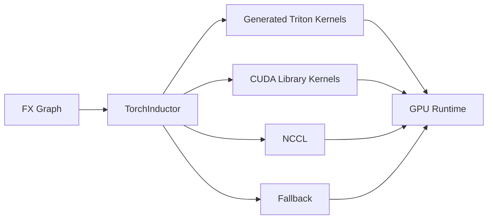

This is why `torch.compile` should not be understood as simply translating an entire model into one GPU kernel. It restructures captured regions and generates an optimized execution plan containing multiple types of kernels and runtime operations.

---

## ⑫ Compilation Does Not Eliminate Every Synchronization

Compiler optimization can reduce Python overhead, kernel launches, and intermediate memory traffic, but it does not automatically remove every host synchronization.

A CUDA tensor may still be materialized on the host when Python requires its value. Common examples include scalar extraction, printing a tensor, converting a CUDA tensor into a Python boolean, or branching on device-resident data outside a captured tensor graph.

```python
if cuda_tensor > 0:
    run_operation()
```

When Python must evaluate the condition, the host may need to wait until the GPU value becomes available.

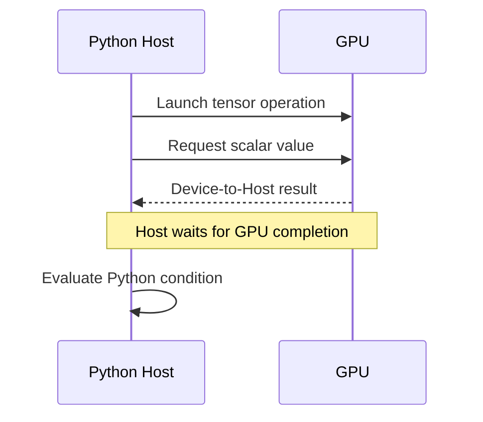

Whether a compiler can transform such code depends on how the operation is captured and whether its control flow can be represented safely. Data-dependent Python behavior may instead produce a graph break or remain outside the compiled graph.

This connects directly to the host synchronization previously observed in Transformers Sequence Parallel loss aggregation.

```python
total_loss = sum(
    losses_per_rank[rank] * good_tokens_per_rank[rank]
    for rank in range(sp_world_size)
    if good_tokens_per_rank[rank] > 0
)
```

The condition evaluates CUDA tensor values from Python. Nsight Systems exposed the resulting synchronization as repeated small Device-to-Host copies and host-side waiting.

The optimized implementation replaced Python branching with tensor operations so that the filtering and aggregation remained on the device.

```mermaid
flowchart TD
    PROFILE["Nsight Systems Profile"]
    MEMCPY["Repeated Small DtoH Copies"]
    WAIT["Host-side Waiting"]
    SOURCE["Python Conditional on CUDA Tensor"]
    FIX["GPU-side Tensor Aggregation"]
    PR["Transformers Upstream Contribution"]

    PROFILE --> MEMCPY
    MEMCPY --> WAIT
    WAIT --> SOURCE
    SOURCE --> FIX
    FIX --> PR
```

This case demonstrates an important boundary: compiler architecture explains how PyTorch can optimize captured tensor programs, while system profiling reveals what actually happened at runtime. Both perspectives are required when diagnosing distributed GPU workloads.

---

## ⑬ Observing the Pipeline

PyTorch provides logging and debugging options for inspecting graph capture and compiler output.

A minimal example is:

```python
import torch

class Model(torch.nn.Module):
    def forward(self, x, bias):
        return torch.relu(x + bias) * 2

model = Model().cuda()
compiled_model = torch.compile(model)

x = torch.randn(1024, 1024, device="cuda")
bias = torch.randn(1024, 1024, device="cuda")

output = compiled_model(x, bias)
```

Dynamo and graph-break logs can be enabled using `TORCH_LOGS`.

```bash
TORCH_LOGS="dynamo,graph_breaks,recompiles" python example.py
```

Generated Inductor artifacts can be inspected using the compile debug option.

```bash
TORCH_COMPILE_DEBUG=1 python example.py
```

The exact debug output depends on the PyTorch version and configuration, but it may include FX graphs, Inductor intermediate representations, generated Triton code, generated C++ code, and compilation metadata.

The compiler view and the profiler view answer different questions.

```mermaid
flowchart LR
    SOURCE["Python Source"]
    LOGS["Dynamo and Inductor Logs"]
    GRAPH["Captured and Generated Code"]
    NSIGHT["Nsight Systems"]
    RUNTIME["Actual CPU and GPU Timeline"]

    SOURCE --> LOGS
    LOGS --> GRAPH
    GRAPH --> NSIGHT
    NSIGHT --> RUNTIME
```

Compiler logs explain how the program was transformed. Nsight Systems explains when CPU work, memory copies, CUDA kernels, synchronization, and communication actually occurred.

---

## ⑭ The Complete Mental Model

The entire path can now be summarized in one diagram.

```mermaid
flowchart TD
    PY["Python Model"]
    DYNAMO["TorchDynamo<br/>Bytecode Analysis and Graph Capture"]
    FX["FX Graph<br/>Tensor Program Representation"]
    META["FakeTensor and Symbolic Shapes<br/>Metadata Propagation"]
    AOT["AOTAutograd<br/>Forward and Backward Graphs"]
    DECOMP["ATen and Primitive Decomposition<br/>Operator Simplification"]
    INDUCTOR["TorchInductor<br/>Lowering, Fusion, Scheduling"]
    BACKEND{"Code-generation Target"}
    TRITON["Triton GPU Kernels"]
    CPP["Generated C++"]
    LIBRARY["Existing CUDA Libraries"]
    DEVICE["GPU or CPU Execution"]
    PROFILE["Nsight Systems and Runtime Profiling"]
    OPT["Source or Compiler Optimization"]

    PY --> DYNAMO
    DYNAMO --> FX
    FX --> META
    META --> AOT
    AOT --> DECOMP
    DECOMP --> INDUCTOR
    INDUCTOR --> BACKEND
    BACKEND -->|GPU| TRITON
    BACKEND -->|CPU| CPP
    INDUCTOR --> LIBRARY
    TRITON --> DEVICE
    CPP --> DEVICE
    LIBRARY --> DEVICE
    DEVICE --> PROFILE
    PROFILE --> OPT
    OPT --> PY
```

The key responsibilities are:

| Component | Primary responsibility |
|---|---|
| `torch.compile` | User-facing entry point for compilation |
| TorchDynamo | Captures Python tensor execution into FX graphs |
| FX | Represents captured operations and data dependencies |
| FakeTensor | Propagates tensor metadata without full computation |
| Symbolic Shapes | Represents dimensions that may vary at runtime |
| AOTAutograd | Produces compiler-visible forward and backward graphs |
| Decomposition / PrimTorch | Reduces broad operators into smaller operator sets |
| TorchInductor | Lowers, optimizes, fuses, schedules, and generates code |
| Triton | Compiles generated GPU programs into executable kernels |
| CUDA Runtime and Driver | Launches and manages GPU execution |
| Nsight Systems | Reveals the resulting CPU and GPU runtime timeline |

---

## ⑮ Conclusion

Modern PyTorch execution involves much more than launching CUDA kernels from Python. Between the original model and the final runtime execution lies a compiler stack responsible for graph capture, intermediate representations, automatic differentiation, operator decomposition, optimization, and backend-specific code generation.

Understanding this pipeline provides a mental model for reasoning about performance. Instead of viewing GPU execution as a black box, it becomes possible to identify where Python execution ends, where graph capture begins, how kernels are generated, and why certain optimizations—or performance bottlenecks—occur.

In the following posts, each stage of the pipeline will be explored in greater detail:

- `TorchDynamo` — Bytecode analysis, graph capture, guards, and graph breaks
- `FX Graph` — Intermediate representation, FakeTensor, and symbolic shapes
- `AOTAutograd` — Forward/backward graph extraction and operator decomposition
- `TorchInductor` — Lowering, scheduling, kernel fusion, and optimization
- `Triton` — GPU kernel generation and interaction with CUDA
- `Profiler` — Connecting compiler internals with Nsight Systems timelines and real optimization cases

Ultimately, the goal is not simply to understand each compiler component in isolation, but to connect the entire journey—from Python source code to GPU execution—and to use that understanding to analyze and optimize real-world AI workloads.

---

## References

- [PyTorch Compiler Documentation](https://docs.pytorch.org/docs/stable/user_guide/torch_compiler/torch.compiler.html)
- [torch.compile API](https://docs.pytorch.org/docs/stable/generated/torch.compile.html)
- [TorchDynamo Overview](https://docs.pytorch.org/docs/stable/user_guide/torch_compiler/torch.compiler_dynamo_overview.html)
- [Dynamo Core Concepts](https://docs.pytorch.org/docs/stable/user_guide/torch_compiler/compile/programming_model.dynamo_core_concepts.html)
- [Torch Compiler Troubleshooting](https://docs.pytorch.org/docs/stable/user_guide/torch_compiler/torch.compiler_troubleshooting.html)
- [AOTInductor](https://docs.pytorch.org/docs/stable/user_guide/torch_compiler/torch.compiler_aot_inductor.html)
- [Hugging Face Transformers Issue #47068](https://github.com/huggingface/transformers/issues/47068)
- [Hugging Face Transformers Pull Request #47073](https://github.com/huggingface/transformers/pull/47073)

---

## TL;DR

- `torch.compile` captures compatible Python tensor operations and sends them through the PyTorch compiler stack.
- TorchDynamo extracts tensor operations from Python bytecode into FX graphs.
- FakeTensor and symbolic shapes provide tensor metadata for graph analysis and specialization.
- AOTAutograd exposes forward and backward computation as compiler-visible graphs.
- Operator decomposition reduces complex PyTorch operations into smaller ATen or primitive operations.
- TorchInductor performs lowering, fusion, scheduling, and target-specific code generation.
- GPU workloads commonly use generated Triton kernels together with existing CUDA library kernels.
- Graph breaks divide Python execution into multiple compiled and eager regions.
- Compilation can reduce dispatch and memory overhead, but it does not automatically eliminate every host synchronization.
- Compiler logs explain graph transformation, while Nsight Systems reveals the actual CPU and GPU runtime behavior.
