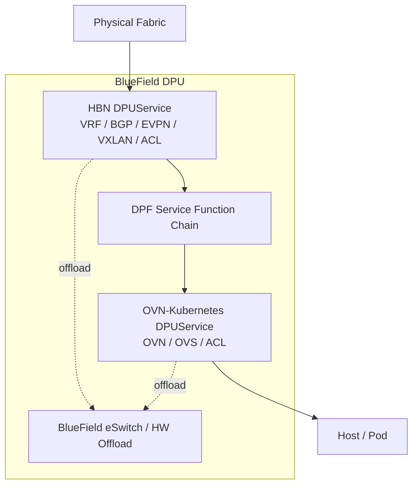
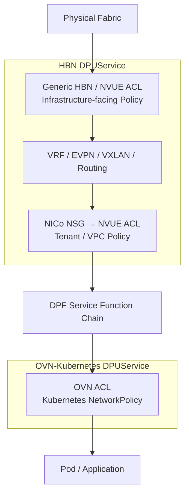
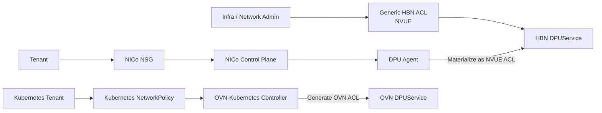

🔍**Understanding DPU-based network isolation in a multi-tenant AI Factory.**

> In a multi-tenant AI Factory, network isolation cannot stop at Kubernetes namespaces.
>
> The infrastructure must separate tenant routing domains before traffic reaches the host, enforce tenant-level L3/L4 policy independently of the workload orchestrator, and then apply application-level policy inside Kubernetes.
>
> NVIDIA BlueField DPUs provide this enforcement point. HBN can provide VRF, EVPN/VXLAN, routing, and ACL functions on the DPU; NICo adds tenant-aware VPC and Network Security Group abstractions; OVN-Kubernetes applies Kubernetes `NetworkPolicy`; and DPF Service Function Chaining connects these DPU network functions into a traffic path.

---

## ① Why the DPU Becomes the Network Isolation Boundary

A BlueField DPU is not simply a NIC that forwards packets to the host. It runs an Arm-based Linux environment and can host network services such as **HBN** and **OVN-Kubernetes**.

NVIDIA's [DOCA Platform Framework (DPF)](https://networking-docs.nvidia.com/dpf/26.4.0/) provisions DPUs and orchestrates applications running on them through Kubernetes APIs. In DPF, those applications are represented as `DPUService` objects.

The [DPF architecture overview](https://networking-docs.nvidia.com/dpf/26.4.0/overview) describes the basic deployment flow as:

```text
DPUService
    ↓
DPF Controller
    ↓
Argo CD
    ↓
DPUCluster
    ↓
DPUService Pod on each DPU Node
```

This makes the DPU a natural **off-host enforcement point**: network isolation can be applied before a packet reaches the tenant's Host OS or application.

HBN itself packages multiple network functions inside a container. NVIDIA's [HBN architecture guide](https://docs.nvidia.com/doca/archive/doca-v2.0.2/doca-hbn-service/index.html) explains that Linux routing and bridging state is observed through Netlink and accelerated into BlueField hardware tables through `nl2docad` and DOCA.



The important point is that **HBN and OVN are DPU services; their ACLs are functions inside those services**.

---

## ② Two DPU-Level Network Virtualization Models

There are two related but distinct NVIDIA models worth separating.

### NICo + HBN VPC

NICo's production-oriented Ethernet isolation model uses HBN on the DPU.

According to [NICo Network Isolation](https://docs.nvidia.com/infra-controller/documentation/operations-day-2/network-isolation), Ethernet isolation is enforced using:

> **DPU VRF per VPC (HBN/NVUE) over a pure Type-5 EVPN overlay**

Each VPC receives its own VRF on every DPU that hosts an instance belonging to that VPC. A dedicated VNI identifies the L3 VXLAN tunnel, while EVPN Type-5 distributes tenant IP prefixes between DPUs.

The detailed flow is documented in [NICo VPC Network Virtualization](https://docs.nvidia.com/infra-controller/documentation/operations-day-2/managing-vp-cs/vpc-network-virtualization).

```text
Tenant A / VPC-A

DPU-1                         DPU-2
┌─────────────┐              ┌─────────────┐
│ VRF-A       │              │ VRF-A       │
│ L3 VNI      │              │ L3 VNI      │
│ VTEP        │              │ VTEP        │
└──────┬──────┘              └──────┬──────┘
       │                            │
       └──── BGP EVPN Type-5 ──────┘
                    +
                  VXLAN
```

The ToR or route server participates in EVPN route exchange, but **NICo and the DPU configure the tenant VRF/VNI state**. The physical fabric does not need to be reconfigured every time a tenant VPC changes.

NICo's [network prerequisites](https://docs.nvidia.com/infra-controller/documentation/getting-started/prerequisites/network) document both ToR EVPN peering and external route-server designs.

### DPF DPUVPC / OVN VPC

DPF also provides an OVN-based VPC model through `DPUVPC`, `DPUVirtualNetwork`, and `DPUServiceInterface`.

The [DOCA VPC OVN Service](https://networking-docs.nvidia.com/dpf/26.4.0/doca-vpc-ovn-service) describes `DPUVPC` as an isolated tenant network that can select multiple DPU nodes and attach PFs, VFs, or services to virtual networks.

This is **not simply "host-local isolation"**. A DPUVPC may span a selected group of DPU nodes.

However, NVIDIA currently marks the OVN VPC Service as **Tech Preview and not recommended for production use**, so it should be distinguished from the current NICo/HBN production isolation model.

---

## ③ HBN Interfaces and Service Function Chaining

One of the easiest ways to understand HBN is to treat it as a network function inserted between physical interfaces and other DPU services.

Older HBN documentation uses names such as `p0_sf`, while current DPF/HBN documentation commonly uses `_if` names such as `p0_if`. The architectural idea is the same: HBN sees virtualized/service-facing interfaces rather than directly owning every physical endpoint.

The archived [HBN SFC documentation](https://docs.nvidia.com/doca/archive/doca-v2.0.2/doca-hbn-service/index.html) describes this indirection explicitly: a `br-sfc` OVS bridge connects physical uplinks, PFs, and VFs to HBN sub-function interfaces.

Conceptually:

```text
Physical p0
    │
    │ DPF SFC
    ▼
HBN p0_if
    │
    │ HBN internal forwarding
    ▼
HBN service-facing interface
    │
    │ DPF SFC
    ▼
OVN service interface
```

DPF formalizes this model with `DPUServiceInterface` and `DPUServiceChain`.

The [DPUServiceChain guide](https://networking-docs.nvidia.com/dpf/26.4.0/dpuservicechain) states that Service Chain controllers create **OVS ports and OVS flows** to steer traffic between DPU service interfaces.

Therefore:

```text
SFC ≠ Firewall Policy
SFC ≠ HBN ACL
SFC ≠ OVN ACL

SFC = Traffic Steering Between DPU Network Functions
```

A useful mental model is:

> **HBN decides how tenant traffic is routed and filtered. SFC decides which network function the traffic reaches next.**

---

## ④ Three Security Layers: Infrastructure, Tenant, and Workload

The DPU security stack becomes much easier to understand when separated into three policy layers.



### 1. Generic HBN ACL — Infrastructure Policy

HBN provides generic stateless and stateful ACL capabilities through NVUE.

The current [HBN Service Configuration](https://docs.nvidia.com/doca/sdk/hbn%2Bservice%2Bconfiguration/index.html) documents ACL creation and interface binding such as:

```bash
nv set acl <acl-name> ...
nv set interface <interface> acl <acl-name> inbound
nv config apply
```

HBN ACLs can be bound to host representors and other HBN interfaces. NVIDIA also documents rules bound to fabric-facing `p0_if` / `p1_if` for NAT and related packet-processing use cases.

Therefore, an operator can use HBN/NVUE ACLs as an **infrastructure-facing policy layer**.

This should not be interpreted as "every HBN ACL is always a VXLAN outer-header ACL." The exact packet match stage depends on the interface and HBN configuration. The important distinction is ownership: **generic HBN ACLs are raw HBN/NVUE policy, not NICo tenant NSG objects**.

### 2. NICo NSG — Tenant / VPC Policy

NICo Network Security Groups are explicitly **tenant-owned** policy objects.

The [NICo NSG documentation](https://docs.nvidia.com/infra-controller/documentation/operations-day-2/network-security-groups) defines NSGs as stateful or stateless L3/L4 filters applied on top of the VPC/VRF model.

The documented isolation order is:

```text
VPC / VRF
    ↓
deny_prefixes
    ↓
Operator policy_overrides
    ↓
Tenant NSG
```

NSG rules can match:

- Source / destination CIDR
- TCP, UDP, ICMP
- Source / destination ports
- Ingress / egress direction
- Permit / deny action

Most importantly, NVIDIA documents the DPU enforcement flow directly:

```text
NICo NSG
    ↓
NICo API Server resolves rules
    ↓
Per-interface configuration sent to DPU
    ↓
DPU Agent
    ↓
NVUE ACL
    ↓
HBN enforcement
```

In other words, **NICo does not invent a separate firewall engine**. It converts a tenant-safe VPC/Instance security abstraction into HBN/NVUE ACL state.

NICo also explicitly recommends NSGs for **East-West filtering inside a VPC**, so NSG is not only a North-South firewall.

### 3. OVN ACL — Kubernetes Workload Policy

Kubernetes `NetworkPolicy` follows a completely separate control-plane path.

```text
Kubernetes NetworkPolicy
    ↓
OVN-Kubernetes Controller
    ↓
OVN ACL
    ↓
OVN / OVS Datapath
```

The official [OVN-Kubernetes ACL design](https://ovn-kubernetes.io/design/acls/) shows how NetworkPolicy rules become OVN ACL entries with separate ingress and egress pipeline stages.

The [OVN-Kubernetes NetworkPolicy guide](https://ovn-kubernetes.io/1.3/features/network-security-controls/network-policy/) describes NetworkPolicy as the workload-level mechanism for isolating selected pods.

This gives us three independent enforcement scopes:

| Security Layer | Policy | Typical Owner | Scope |
|---|---|---|---|
| Infrastructure | Generic HBN / NVUE ACL | Infra / Network Admin | DPU interfaces, fabric-facing traffic |
| Tenant | NICo NSG | Tenant, constrained by Operator | VPC / VRF / Instance L3/L4 |
| Workload | OVN ACL | Kubernetes Tenant / Cluster Admin | Pod / Namespace / Application |

---

## ⑤ The Packet Path Through HBN, NSG, SFC, and OVN

A simplified ingress path can be represented as:

```text
Physical Fabric
      │
      ▼
     p0
      │
      │ SFC #1
      ▼
 HBN p0_if
      │
      │ Generic HBN / NVUE Policy
      ▼
 HBN Processing
      │
      ├─ BGP / EVPN
      ├─ VXLAN
      ├─ VNI → VRF
      └─ Routing
      │
      ▼
 NICo NSG-derived NVUE ACL
      │
      ▼
 HBN service-facing interface
      │
      │ SFC #2
      ▼
 OVN-Kubernetes
      │
      │ OVN ACL
      ▼
     Pod
```

For NICo EVPN/VXLAN VPCs, HBN identifies the tenant routing context using the VNI/VRF model before tenant policy is evaluated.

The [NICo VPC virtualization guide](https://docs.nvidia.com/infra-controller/documentation/operations-day-2/managing-vp-cs/vpc-network-virtualization) documents the VPC VNI as the identifier for the VXLAN L3 tunnel and the per-VPC DPU loopback as the EVPN Type-5 next-hop.

The exact hardware ACL hook is implementation-specific and may be offloaded into BlueField eSwitch tables. What matters architecturally is the policy boundary:

```text
Infrastructure Policy
        ↓
Tenant / VPC Policy
        ↓
Workload Policy
```

All three may ultimately be accelerated by the DPU, but they are **not the same control plane**.

---

## ⑥ Who Creates Each Policy?

This separation is particularly important in a multi-tenant platform.



### Infrastructure Administrator

The infrastructure operator owns the raw DPU networking environment: HBN deployment, service topology, infrastructure ACLs, and usually the DPF Service Chain.

HBN exposes both NVUE CLI and an [NVUE REST API](https://docs.nvidia.com/doca/sdk/HBN-Service-Configuration/index.html), so generic ACL configuration can be automated rather than manually applied on every DPU.

### Tenant

NICo exposes a safer tenant abstraction.

According to the [NSG role model](https://docs.nvidia.com/infra-controller/documentation/operations-day-2/network-security-groups), tenants create and attach their own NSGs to VPCs or instances, while the operator can impose `deny_prefixes`, `policy_overrides`, stateful-ACL settings, and rule-size limits.

This means a tenant can define its own VPC security policy **without receiving raw HBN configuration access**.

### Kubernetes Tenant

Inside Kubernetes, a tenant can create `NetworkPolicy` when Kubernetes RBAC permits it. OVN-Kubernetes translates that workload intent into OVN ACLs.

This policy cannot replace the infrastructure boundary. If the NICo NSG denies a flow, an OVN NetworkPolicy cannot make the flow reachable again.

---

## ⑦ DPUService Is the Deployment Unit, Not the ACL

One final distinction prevents a great deal of confusion.

```text
HBN ACL      ≠ DPUService
NICo NSG     ≠ DPUService
OVN ACL      ≠ DPUService
```

Instead:

```text
HBN DPUService
 ├─ BGP / EVPN / VXLAN / VRF
 ├─ Generic HBN ACL
 └─ NICo NSG → NVUE ACL

OVN-Kubernetes DPUService
 └─ OVN ACL / NetworkPolicy
```

The [DPF overview](https://networking-docs.nvidia.com/dpf/26.4.0/overview) states that a `DPUService` references a Helm chart, is synchronized into the DPUCluster, and runs as a Pod on DPU nodes.

The same document explains that OVN-Kubernetes can be deployed as a DPUService and that additional network functions, including a BGP router or L3 firewall using HBN, can be added to the service chain.

`DPUServiceChain` then determines **how those services are connected**, not which ACL rule is allowed or denied.

```text
DPF
 │
 ├─ DPUService
 │    ├─ HBN
 │    └─ OVN
 │
 └─ DPUServiceChain
      └─ HBN ↔ OVN traffic steering
```

Because these are Kubernetes CRDs, who may create or modify them is ultimately an RBAC decision. In a production multi-tenant AI Factory, however, shared HBN/OVN/SFC topology should normally remain platform-owned, while tenants receive narrower policy interfaces such as NICo NSG and Kubernetes NetworkPolicy.

---

## Summary

- **The DPU is the network enforcement point** that allows tenant isolation to happen before traffic reaches the Host OS.
- **HBN is a DPU network service** providing routing, VRF, BGP/EVPN, VXLAN, and ACL capabilities.
- **NICo Ethernet isolation** creates a per-VPC VRF on DPUs and connects distributed VPC routes through a pure EVPN Type-5 overlay.
- **Generic HBN ACLs** are infrastructure/operator-level HBN/NVUE policy.
- **NICo NSGs** are tenant-owned VPC/Instance L3/L4 policies that the DPU Agent materializes into NVUE ACLs inside the HBN network context.
- **OVN ACLs** are workload-level policies generated from Kubernetes `NetworkPolicy`.
- **DPF SFC does not implement firewall policy.** It connects HBN, OVN, and other DPU network functions by programming DPU service interfaces and OVS flows.
- The resulting security model is best understood as:

```text
Infrastructure Security
        ↓
Generic HBN ACL
        ↓
Tenant / VPC Security
        ↓
NICo NSG
        ↓
Workload Security
        ↓
OVN ACL / NetworkPolicy
```

This separation is what allows an AI Factory to give tenants control over their own network policy without giving them unrestricted access to the underlying DPU or physical fabric.

---

## Official References

- [NVIDIA DOCA Platform Framework 26.4](https://networking-docs.nvidia.com/dpf/26.4.0/)
- [DPF Architecture Overview](https://networking-docs.nvidia.com/dpf/26.4.0/overview)
- [DPF DPUServiceChain](https://networking-docs.nvidia.com/dpf/26.4.0/dpuservicechain)
- [DPF DOCA VPC OVN Service](https://networking-docs.nvidia.com/dpf/26.4.0/doca-vpc-ovn-service)
- [NVIDIA NICo Network Isolation](https://docs.nvidia.com/infra-controller/documentation/operations-day-2/network-isolation)
- [NVIDIA NICo Network Security Groups](https://docs.nvidia.com/infra-controller/documentation/operations-day-2/network-security-groups)
- [NVIDIA NICo VPC Network Virtualization](https://docs.nvidia.com/infra-controller/documentation/operations-day-2/managing-vp-cs/vpc-network-virtualization)
- [NVIDIA NICo Network Prerequisites](https://docs.nvidia.com/infra-controller/documentation/getting-started/prerequisites/network)
- [NVIDIA HBN Service Configuration](https://docs.nvidia.com/doca/sdk/hbn%2Bservice%2Bconfiguration/index.html)
- [NVIDIA DOCA HBN Service Architecture (Archived 2.0.2)](https://docs.nvidia.com/doca/archive/doca-v2.0.2/doca-hbn-service/index.html)
- [OVN-Kubernetes ACL Design](https://ovn-kubernetes.io/design/acls/)
- [OVN-Kubernetes NetworkPolicy](https://ovn-kubernetes.io/1.3/features/network-security-controls/network-policy/)
