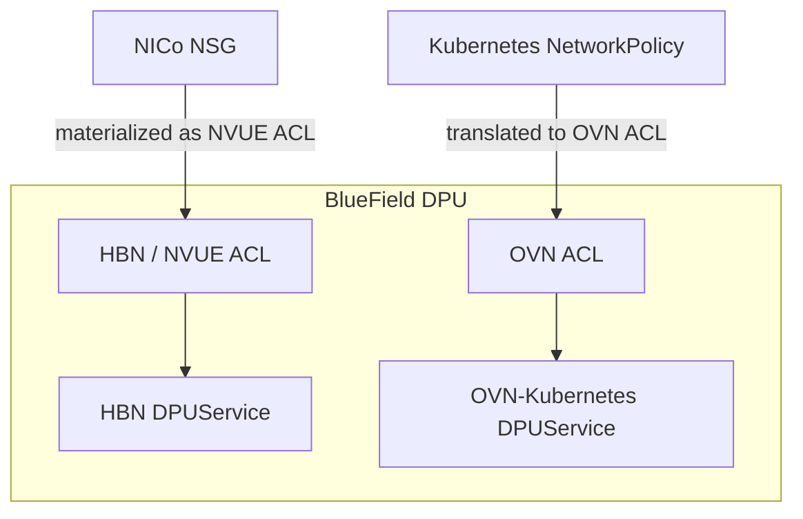
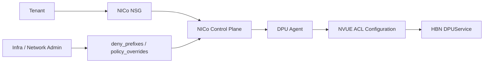
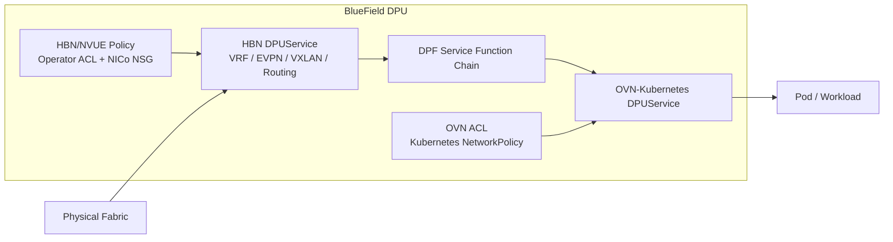

🔍**Understanding DPU-based network isolation in a multi-tenant AI Factory.**

> In a multi-tenant AI Factory, network isolation cannot stop at Kubernetes namespaces.
>
> Tenant routing domains must be separated before traffic reaches the host, tenant-level L3/L4 policy must remain independent from workload-level policy, and the platform must enforce those controls without giving tenants unrestricted access to the underlying fabric.
>
> NVIDIA BlueField DPUs provide an off-host enforcement point for this architecture. HBN provides routing, VRF, EVPN/VXLAN, and ACL capabilities; NICo exposes tenant-facing VPC and Network Security Group abstractions; OVN-Kubernetes provides Kubernetes workload networking and `NetworkPolicy`; and DPF Service Function Chaining connects DPU network functions when multiple services are composed on the same DPU.

---

## ① Start with the Most Important Distinction: Service vs Policy

The first distinction is simple, but it prevents most of the confusion around this architecture.

**HBN and OVN-Kubernetes are DPU services. ACLs and NSGs are not.**

NVIDIA's [DOCA Platform Framework (DPF)](https://networking-docs.nvidia.com/dpf/26.4.0/) provisions BlueField DPUs and orchestrates services that run on them through Kubernetes APIs.

The [DPF architecture overview](https://networking-docs.nvidia.com/dpf/26.4.0/overview) describes the `DPUService` lifecycle as:

```text
DPUService
    ↓
DPUService Controller
    ↓
Argo CD Application
    ↓
DPUCluster
    ↓
DPUService Pod on the DPU Node
```

HBN and OVN-Kubernetes can both be deployed as DPU network services.

By contrast:

```text
HBN ACL                  ≠ DPUService
NICo NSG                 ≠ DPUService
Kubernetes NetworkPolicy ≠ DPUService
OVN ACL                  ≠ DPUService
```

Instead, these objects configure policy **inside** the corresponding service.



This is the foundation for understanding the rest of the stack.

---

## ② NICo Ethernet Isolation: VRF + EVPN Type-5 + NSG

NICo's Ethernet isolation model is built on HBN running on the BlueField DPU.

According to NVIDIA's [NICo Network Isolation](https://docs.nvidia.com/infra-controller/documentation/operations-day-2/network-isolation), each VPC materializes as a Linux VRF on every DPU that hosts an interface belonging to that VPC.

The tenant overlay is explicitly described as a:

> **pure Type-5 EVPN IP-prefix overlay**

NICo does not stretch a tenant L2 segment across the fabric.

A simplified model looks like this:

```text
Tenant A / VPC-A

DPU-1                              DPU-2
┌────────────────┐                ┌────────────────┐
│ HBN            │                │ HBN            │
│                │                │                │
│ VRF-A          │                │ VRF-A          │
│ L3 VNI         │                │ L3 VNI         │
│ EVPN Type-5    │                │ EVPN Type-5    │
└───────┬────────┘                └───────┬────────┘
        │                                 │
        └────── EVPN Route Exchange ──────┘
                      +
                    VXLAN
```

The detailed VPC behavior is documented in [NICo VPC Network Virtualization](https://docs.nvidia.com/infra-controller/documentation/operations-day-2/managing-vp-cs/vpc-network-virtualization).

The physical fabric provides IP reachability and participates in EVPN route exchange, but tenant routing state is maintained on the DPUs.

NICo's [Network Prerequisites](https://docs.nvidia.com/infra-controller/documentation/getting-started/prerequisites/network) documents two supported EVPN peering patterns:

- direct EVPN peering between DPUs and ToRs
- external EVPN route servers

NICo does not need to reconfigure every leaf switch whenever a tenant VPC changes.

The result is a distributed routing model:

```text
VPC
 ↓
Per-DPU VRF
 ↓
L3 VNI
 ↓
EVPN Type-5 Prefix Distribution
 ↓
VXLAN Transport
```

---

## ③ NSG Is Not a Separate Firewall Engine

This is the point that is easiest to misunderstand.

A NICo Network Security Group is a **tenant-facing control-plane policy object**.

It is not a separate DPU network service and it is not an alternative to HBN.

NVIDIA's [Network Security Groups](https://docs.nvidia.com/infra-controller/documentation/operations-day-2/network-security-groups) documentation explicitly describes the enforcement path:

```text
Tenant creates / updates NSG
        ↓
NICo API Server resolves rules
        ↓
Per-interface configuration
        ↓
DPU Agent
        ↓
NVUE ACL
        ↓
HBN enforcement
```

The key phrase in NVIDIA's documentation is that:

> the DPU agent **materialises them into NVUE ACLs**

Therefore, the relationship is:

```text
NICo NSG
    ↓
Control-plane abstraction
    ↓
NVUE ACL
    ↓
HBN DPUService
```

or, stated more directly:

> **The enforcement implementation of a NICo NSG is HBN/NVUE ACL state.**

This does **not** mean that an NSG "becomes HBN" or that an NSG itself is a `DPUService`.

It means that NICo translates a tenant-safe policy abstraction into the ACL mechanism already provided by HBN.

---

## ④ HBN ACL Is Not the Same Thing as "Underlay ACL"

Another common simplification is:

```text
HBN ACL = Underlay
NSG     = Overlay
```

That model is too strict.

HBN ACL is a **general ACL capability exposed through NVUE**. The policy can be attached to different HBN interfaces and traffic contexts.

The [HBN Service Configuration](https://docs.nvidia.com/doca/sdk/hbn%2Bservice%2Bconfiguration/index.html) documents ACL creation and interface attachment through NVUE, for example:

```bash
nv set acl <acl-name> ...
nv set interface <interface> acl <acl-name> inbound
nv config apply
```

Therefore, a generic HBN ACL may be used for infrastructure-facing filtering, host-facing filtering, routed traffic, or other HBN-controlled traffic depending on where it is attached.

Conceptually:

```text
HBN / NVUE ACL Capability
        │
        ├─ Operator-created generic ACL
        │    └─ raw HBN/NVUE policy
        │
        └─ NICo-generated ACL
             └─ derived from tenant NSG
```

The difference between a generic HBN ACL and a NICo NSG is primarily the **control-plane abstraction and ownership**, not the existence of two different firewall engines.

| Policy | Created Through | Enforcement |
|---|---|---|
| Generic HBN ACL | NVUE / operator automation | HBN ACL |
| NICo NSG | NICo API | HBN/NVUE ACL |
| `deny_prefixes` | NICo site configuration | HBN/NVUE ACL |
| `policy_overrides` | NICo operator configuration | HBN/NVUE ACL |

This is also why the term **"HBN Underlay ACL"** should be used carefully.

An operator can certainly attach HBN ACL policy to a fabric-facing interface and use it as infrastructure protection. But HBN ACL itself is not an underlay-only feature.

---

## ⑤ Why Can an HBN-Backed NSG Filter East-West Traffic?

Because **East-West does not imply OVN**.

NICo explicitly states that NSGs are suitable for filtering **East-West traffic inside a VPC**.

This may initially seem contradictory:

```text
NSG
 ↓
HBN/NVUE ACL

but

NSG filters East-West traffic
```

There is no contradiction.

HBN is already the component implementing the tenant's distributed VPC routing domain.

For a NICo-managed Ethernet VPC:

```text
Instance A
   │
   ▼
HBN / VRF-A
   │
   │ EVPN Type-5 + VXLAN
   ▼
HBN / VRF-A
   │
   ▼
Instance B
```

The East-West flow is still passing through the HBN-controlled VPC context.

Therefore, the tenant NSG can be enforced as an HBN/NVUE ACL even though the traffic is East-West.

```text
Instance A
   │
   ▼
Tenant-facing HBN Interface
   │
   ├─ VPC / VRF policy
   ├─ Operator-enforced policy
   └─ NSG-derived NVUE ACL
   │
   ▼
EVPN / VXLAN Tenant Network
```

The important separation is:

```text
Underlay / Overlay
= traffic and routing architecture

HBN ACL / NSG
= policy abstraction and enforcement mechanism
```

They are not equivalent dimensions.

---

## ⑥ NICo Documents an Explicit Policy Hierarchy

NICo does not simply push a tenant NSG without infrastructure controls around it.

The [NSG documentation](https://docs.nvidia.com/infra-controller/documentation/operations-day-2/network-security-groups) describes the tenant traffic policy stack as:

```text
1. VPC / VRF routing isolation
        ↓
2. deny_prefixes
        ↓
3. Operator policy_overrides
        ↓
4. Tenant NSG
```

`deny_prefixes` provides a site-wide deny list, typically protecting management and infrastructure prefixes.

`policy_overrides` provides operator-controlled rules that are evaluated before tenant NSG rules.

This creates an important multi-tenant property:

> A tenant can control its own NSG, but it cannot use that NSG to bypass infrastructure policy imposed by the operator.

The control path is therefore better represented as:



Notice what is **not** present in this flow:

```text
NICo NSG → OVN ACL
```

NICo NSG is an HBN-backed policy.

---

## ⑦ OVN-Kubernetes Is a Separate Policy Domain

OVN-Kubernetes has its own control plane and its own ACL model.

A Kubernetes workload policy follows a different path:

```text
Kubernetes NetworkPolicy
        ↓
OVN-Kubernetes Control Plane
        ↓
OVN ACL
        ↓
OVN / OVS Datapath
```

The [OVN-Kubernetes ACL design](https://ovn-kubernetes.io/design/acls/) explains how Kubernetes network policy is represented through OVN ACLs.

The [OVN-Kubernetes NetworkPolicy documentation](https://ovn-kubernetes.io/1.3/features/network-security-controls/network-policy/) describes `NetworkPolicy` as the Kubernetes workload-level isolation mechanism.

Therefore:

| Control-Plane Policy | Backend |
|---|---|
| NICo NSG | HBN / NVUE ACL |
| Kubernetes `NetworkPolicy` | OVN ACL |

An NSG does **not** dynamically choose between HBN and OVN.

```text
NICo NSG
   └─ HBN/NVUE only

Kubernetes NetworkPolicy
   └─ OVN ACL
```

This is the cleanest way to separate the two security domains.

---

## ⑧ HBN and OVN Can Still Be Chained Together

Even though their policy engines are separate, HBN and OVN can coexist on the same BlueField DPU.

The [DPF architecture overview](https://networking-docs.nvidia.com/dpf/26.4.0/overview) explicitly describes OVN-Kubernetes as a DPUService and notes that other network functions, such as a BGP router or L3 firewall using HBN, can be added to the service chain.

DPF uses `DPUServiceInterface` and `DPUServiceChain` to steer traffic through those services.

According to the [DPUServiceChain documentation](https://networking-docs.nvidia.com/dpf/26.4.0/dpuservicechain):

- `DPUServiceInterface` represents service-facing OVS interfaces
- the ServiceInterface controller creates OVS ports
- the ServiceChain controller creates OVS flows
- `DPUServiceChain` defines how traffic is steered through those interfaces

Conceptually:



The crucial distinction is:

```text
SFC = traffic steering

HBN ACL / NSG = HBN policy

OVN ACL = OVN workload policy
```

SFC does not connect ACLs to each other. It connects **network functions**.

---

## ⑨ Do Not Model Generic HBN ACL → NSG → OVN ACL as Three Fixed Datapath Stages

A tempting diagram is:

```text
Fabric
 ↓
Generic HBN ACL
 ↓
NSG
 ↓
OVN ACL
 ↓
Pod
```

This is useful as a high-level security-layer metaphor, but it is misleading as a literal datapath.

The reason is that the first two policies are both part of the **HBN/NVUE enforcement domain**.

A more accurate representation is:

```text
                        BlueField DPU

              ┌─────────────────────────┐
              │ HBN DPUService          │
              │                         │
              │ HBN / NVUE ACL Engine   │
              │   ├─ Generic ACL        │
              │   ├─ deny_prefixes      │
              │   ├─ policy_overrides   │
              │   └─ NICo NSG           │
              │                         │
              │ VRF / EVPN / VXLAN      │
              └────────────┬────────────┘
                           │
                           │ DPF SFC
                           ▼
              ┌─────────────────────────┐
              │ OVN DPUService          │
              │                         │
              │ OVN ACL                 │
              │   └─ NetworkPolicy      │
              └─────────────────────────┘
```

There are therefore **two major enforcement domains**, not three completely separate firewall engines:

```text
HBN Policy Domain
 ├─ Operator / generic HBN ACL
 ├─ NICo deny_prefixes
 ├─ NICo policy_overrides
 └─ NICo NSG

OVN Policy Domain
 └─ Kubernetes NetworkPolicy → OVN ACL
```

NICo documents the relative ordering of `deny_prefixes`, `policy_overrides`, and tenant NSG.

However, an independently configured generic HBN ACL should not be assumed to have a universal ordering relative to NSG policy. Its behavior depends on its interface attachment, direction, and ACL priority.

---

## ⑩ Control Plane vs Data Plane

The complete architecture becomes clearer when separating the policy control planes from packet enforcement.

### NICo / HBN Control Plane

```text
Tenant
  ↓
NICo NSG
  ↓
NICo API Server
  ↓
DPU Agent
  ↓
NVUE Configuration
  ↓
HBN
```

### Operator HBN Control Plane

```text
Infra Admin
  ↓
NVUE / Automation
  ↓
Generic HBN ACL
  ↓
HBN
```

### Kubernetes / OVN Control Plane

```text
Kubernetes Tenant
  ↓
NetworkPolicy
  ↓
OVN-Kubernetes Controller
  ↓
OVN ACL
  ↓
OVN
```

These control planes may ultimately program forwarding and filtering behavior that is accelerated on the same BlueField hardware, but they remain logically independent.

A tenant can therefore have:

```text
VPC Routing Isolation
        +
NICo NSG
        +
Kubernetes NetworkPolicy
```

without those policies becoming the same object or being managed by the same controller.

---

## ⑪ Who Should Own Each Layer?

For a production multi-tenant AI Factory, a clean ownership model is:

| Component / Policy | Recommended Owner | Purpose |
|---|---|---|
| DPF / DPUCluster | Platform Admin | DPU orchestration |
| HBN DPUService | Platform / Network Admin | VPC routing, EVPN/VXLAN, L3 functions |
| Generic HBN ACL | Infra / Network Admin | Low-level infrastructure policy |
| `deny_prefixes` | Infra / Network Admin | Site-wide protected prefixes |
| `policy_overrides` | Infra / Network Admin | Mandatory site security baseline |
| NICo NSG | Tenant | VPC / instance L3/L4 security |
| OVN-Kubernetes DPUService | Platform Admin | Kubernetes workload networking |
| Kubernetes `NetworkPolicy` | Kubernetes Tenant | Pod / Namespace security |
| DPUServiceChain | Platform Admin | Traffic steering between DPU services |

This division allows the tenant to control the policies that belong to its workload while the operator retains control over the physical and DPU infrastructure.

---

## ⑫ What About DPUVPC?

DPF also provides a separate OVN-based VPC model using objects such as `DPUVPC` and `DPUVirtualNetwork`.

The [DOCA VPC OVN Service](https://networking-docs.nvidia.com/dpf/26.4.0/doca-vpc-ovn-service) describes an isolated VPC model implemented through OVN.

This should not be confused with NICo's NSG model.

```text
NICo VPC
   ↓
HBN VRF / EVPN Type-5 / VXLAN
   ↓
NICo NSG
   ↓
HBN/NVUE ACL
```

versus:

```text
DPF DPUVPC
   ↓
OVN-based VPC Service
   ↓
OVN logical networking
```

They are different control-plane models.

The OVN VPC Service is also documented as **Tech Preview** in the current DPF release, so it should not be treated as the production enforcement backend for NICo NSG.

---

## Summary

- **HBN and OVN-Kubernetes are DPU services. NSG, HBN ACL, NetworkPolicy, and OVN ACL are policies or enforcement objects, not DPU services.**
- **NICo Ethernet isolation uses per-VPC HBN VRFs with a pure EVPN Type-5 overlay and VXLAN transport.**
- **NICo NSG is a tenant-level control-plane abstraction whose rules are materialized by the DPU Agent as NVUE ACLs in HBN.**
- **NSG is therefore HBN-backed. It does not dynamically become an OVN ACL.**
- **HBN ACL is a generic HBN/NVUE capability, not an underlay-only firewall.**
- **NICo NSG can still filter East-West traffic because HBN owns the tenant VPC/VRF and EVPN routing context through which that traffic flows.**
- **OVN-Kubernetes uses a separate policy path: Kubernetes `NetworkPolicy` becomes OVN ACL.**
- **DPF Service Function Chaining connects HBN, OVN, and other DPU network functions; it does not implement ACL policy itself.**
- The most accurate security model is therefore:

```text
                 BlueField DPU

HBN Policy Domain
 ├─ Generic HBN / NVUE ACL
 ├─ deny_prefixes
 ├─ policy_overrides
 └─ NICo NSG → NVUE ACL

        │
        │ DPF Service Function Chain
        ▼

OVN Policy Domain
 └─ Kubernetes NetworkPolicy → OVN ACL
```

The key architectural insight is that **policy scope and enforcement engine are different concepts**.

NICo NSG is a tenant-level overlay/VPC security policy, but its enforcement engine is HBN/NVUE. OVN NetworkPolicy is a workload-level Kubernetes policy, and its enforcement engine is OVN. The DPU provides the common hardware enforcement point, while DPF provides the orchestration and service-chaining layer that connects these network functions.

---

## Official References

- [NVIDIA Infra Controller - Network Isolation](https://docs.nvidia.com/infra-controller/documentation/operations-day-2/network-isolation)
- [NVIDIA Infra Controller - Network Security Groups](https://docs.nvidia.com/infra-controller/documentation/operations-day-2/network-security-groups)
- [NVIDIA Infra Controller - VPC Network Virtualization](https://docs.nvidia.com/infra-controller/documentation/operations-day-2/managing-vp-cs/vpc-network-virtualization)
- [NVIDIA Infra Controller - Network Prerequisites](https://docs.nvidia.com/infra-controller/documentation/getting-started/prerequisites/network)
- [NVIDIA Infra Controller - Key Capabilities](https://docs.nvidia.com/infra-controller/documentation/overview/key-capabilities)
- [DOCA Platform Framework 26.4](https://networking-docs.nvidia.com/dpf/26.4.0/)
- [DPF Architecture Overview](https://networking-docs.nvidia.com/dpf/26.4.0/overview)
- [DPF DPUServiceChain](https://networking-docs.nvidia.com/dpf/26.4.0/dpuservicechain)
- [DPF DOCA VPC OVN Service](https://networking-docs.nvidia.com/dpf/26.4.0/doca-vpc-ovn-service)
- [NVIDIA HBN Service Configuration](https://docs.nvidia.com/doca/sdk/hbn%2Bservice%2Bconfiguration/index.html)
- [OVN-Kubernetes ACL Design](https://ovn-kubernetes.io/design/acls/)
- [OVN-Kubernetes NetworkPolicy](https://ovn-kubernetes.io/1.3/features/network-security-controls/network-policy/)

## Source Code Reference

- [NICo / NVIDIA Infra Controller GitHub Repository](https://github.com/dsx-ai-factory/infra-controller)
- [DPU Agent - ethernet_virtualization.rs](https://github.com/dsx-ai-factory/infra-controller/blob/main/crates/agent/src/ethernet_virtualization.rs)
- [DPU Agent NVUE Template - nvue_startup_fnn.conf](https://github.com/dsx-ai-factory/infra-controller/blob/main/crates/agent/templates/nvue_startup_fnn.conf)
