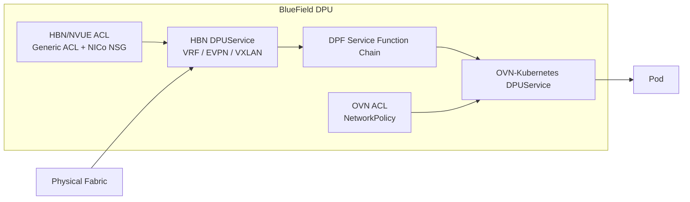

🔍**Understanding DPU-based network isolation in a multi-tenant AI Factory.**

> NVIDIA BlueField can enforce network isolation before traffic reaches the host.
>
> HBN provides the DPU-side routing and EVPN/VXLAN functions, NICo provides tenant-facing VPC and NSG abstractions, and OVN-Kubernetes provides workload-level `NetworkPolicy`.
>
> The key is to separate **routing**, **tenant ACL policy**, and **workload ACL policy**.

---

## ① HBN Is the DPU Network Service

HBN is a `DPUService` that provides routing and network functions on BlueField.

According to the [DPF architecture overview](https://networking-docs.nvidia.com/dpf/26.4.0/overview), DPU services are deployed into the `DPUCluster` and run on DPU nodes.

HBN can cover both native routing and EVPN/VXLAN overlay functions.

```text
HBN DPUService
 ├─ Native L3 / BGP
 ├─ VRF
 ├─ EVPN
 ├─ VXLAN / VNI
 └─ HBN / NVUE ACL
```

The HBN ACL framework is therefore **not underlay-only**. It is a generic ACL capability used in different HBN traffic contexts.

Official reference: [NVIDIA HBN Service Configuration](https://docs.nvidia.com/doca/sdk/hbn%2Bservice%2Bconfiguration/index.html)

---

## ② NICo Uses a Pure Type-5 EVPN L3 Overlay

NICo Ethernet VPC isolation is implemented through HBN.

NVIDIA describes the tenant network as a:

> **pure Type-5 EVPN IP-prefix overlay**

This means NICo does **not** extend a tenant L2 broadcast domain across the fabric.

```text
VPC-A

DPU-1                          DPU-2
┌──────────────┐              ┌──────────────┐
│ VRF-A        │              │ VRF-A        │
│ L3 VNI       │              │ L3 VNI       │
│ Type-5       │              │ Type-5       │
└──────┬───────┘              └──────┬───────┘
       │                             │
       └──── EVPN IP Prefix ─────────┘
                  +
                VXLAN
```

The important distinction is:

```text
EVPN Type-2
= MAC reachability
= L2 stretch

EVPN Type-5
= IP prefix reachability
= L3 routed overlay
```

NICo uses the second model for tenant VPCs.

Official references:

- [NICo Network Isolation](https://docs.nvidia.com/infra-controller/documentation/operations-day-2/network-isolation)
- [NICo VPC Network Virtualization](https://docs.nvidia.com/infra-controller/documentation/operations-day-2/managing-vp-cs/vpc-network-virtualization)

---

## ③ Routing and NSG Are Different

The VPC/VRF determines **reachability**.

The NSG determines **which reachable L3/L4 flows are allowed**.

```text
Routing
"Where can this packet go?"

        ↓

NSG
"Is this TCP/UDP/ICMP flow allowed?"
```

For example:

```text
VPC-A / VRF-A

Instance-A                    Instance-B
10.1.1.10                     10.1.2.20
    │                              ▲
    └──── EVPN Type-5 Routing ─────┘
                   │
                   └─ NSG:
                      TCP/443 Allow
                      TCP/22  Deny
```

Changing the NSG does **not** modify the EVPN Type-5 route itself.

It only changes packet filtering on top of an existing VPC/VRF routing domain.

---

## ④ NICo NSG Is Implemented as an HBN/NVUE ACL

A NICo NSG is not a `DPUService`.

It is a tenant-facing control-plane policy object.

NVIDIA documents the enforcement flow as:

```text
Tenant
  ↓
NICo NSG
  ↓
NICo API Server
  ↓
Per-interface desired configuration
  ↓
DPU Agent
  ↓
NVUE ACL
  ↓
Existing HBN DPUService
```

The DPU Agent **materializes NSG rules into NVUE ACLs**.

Therefore:

```text
NSG ≠ HBN DPUService

NSG
= tenant policy abstraction

HBN / NVUE ACL
= enforcement implementation
```

This also explains why NSG can filter East-West traffic inside a VPC even though the enforcement backend is HBN.

Official reference: [NICo Network Security Groups](https://docs.nvidia.com/infra-controller/documentation/operations-day-2/network-security-groups)

---

## ⑤ HBN ACL vs NICo NSG

The two are related, but not identical.

| Policy | Created By | Scope | Enforcement |
|---|---|---|---|
| Generic HBN ACL | Infra / Network Admin | Low-level HBN traffic policy | HBN / NVUE |
| NICo NSG | Tenant | VPC / Instance L3/L4 policy | HBN / NVUE |

A generic HBN ACL may be attached directly through NVUE.

```bash
nv set acl INFRA-ACL ...
nv set interface <interface> acl INFRA-ACL inbound
nv config apply
```

A NICo tenant does not need this raw HBN access.

The tenant instead creates an NSG through NICo, and NICo converts it into HBN/NVUE ACL state.

```text
Infra Admin
 └─ NVUE / HBN ACL

Tenant
 └─ NICo NSG
      ↓
    DPU Agent
      ↓
    NVUE ACL
```

So the distinction is mainly **control-plane abstraction and ownership**, not two different firewall engines.

---

## ⑥ Intra-VPC and Inter-VPC Isolation

NICo uses separate VRFs for separate VPCs.

```text
VPC-A                    VPC-B
VRF-A                    VRF-B
  │                        │
  └────────── X ───────────┘
```

By default, routes are not leaked between VRFs.

Therefore, **inter-VPC isolation is primarily routing isolation**, not an ACL that the operator must manually create for every tenant pair.

Cross-VPC reachability must be explicitly enabled, for example through:

```text
Tenant
 └─ VPC Peering

or

Operator
 └─ Routing Profile / Route Leak
```

Tenant NSGs then control L3/L4 flows **within an already reachable routing domain**.

NICo also provides operator guardrails that are evaluated before tenant NSGs:

```text
VPC / VRF Isolation
      ↓
deny_prefixes
      ↓
policy_overrides
      ↓
Tenant NSG
```

Official references:

- [NICo Network Isolation](https://docs.nvidia.com/infra-controller/documentation/operations-day-2/network-isolation)
- [NICo Network Security Groups](https://docs.nvidia.com/infra-controller/documentation/operations-day-2/network-security-groups)

---

## ⑦ OVN Is a Separate Workload Policy Domain

OVN-Kubernetes is a separate DPU service.

Kubernetes workload policy follows this path:

```text
Kubernetes NetworkPolicy
        ↓
OVN-Kubernetes
        ↓
OVN ACL
        ↓
OVN DPUService
```

Therefore:

```text
NICo NSG
 └─ HBN / NVUE ACL

Kubernetes NetworkPolicy
 └─ OVN ACL
```

An NSG does not dynamically become an OVN ACL.

Official reference: [OVN-Kubernetes ACL Design](https://ovn-kubernetes.io/design/acls/)

---

## ⑧ HBN and OVN Are Connected by SFC

When HBN and OVN run together, DPF can connect them through `DPUServiceChain`.



`DPUServiceChain` is **traffic steering**, not firewall policy.

Official reference: [DPF DPUServiceChain](https://networking-docs.nvidia.com/dpf/26.4.0/dpuservicechain)

---

## Summary

```text
                  BlueField DPU

HBN DPUService
 ├─ Native L3 / BGP
 ├─ VRF
 ├─ EVPN Type-5
 ├─ L3 VNI / VXLAN
 └─ HBN / NVUE ACL
      ├─ Generic HBN ACL
      ├─ deny_prefixes
      ├─ policy_overrides
      └─ NICo NSG
           ↑
        DPU Agent
           ↑
          NICo

        │
        │ DPF SFC
        ▼

OVN DPUService
 └─ OVN ACL
      ↑
 Kubernetes NetworkPolicy
```

The main points are:

- **HBN is the DPU network service.**
- **NICo VPC uses VRF + L3 VNI + pure EVPN Type-5.**
- **NSG does not modify routing. It filters L3/L4 traffic on top of existing VPC routing.**
- **NICo NSG is implemented as HBN/NVUE ACL state.**
- **Inter-VPC isolation is primarily provided by separate VRFs.**
- **OVN NetworkPolicy is a separate workload-policy domain.**
- **SFC connects DPU services; it does not connect ACL rules.**

---

## Official References

- [NVIDIA Infra Controller - Network Isolation](https://docs.nvidia.com/infra-controller/documentation/operations-day-2/network-isolation)
- [NVIDIA Infra Controller - Network Security Groups](https://docs.nvidia.com/infra-controller/documentation/operations-day-2/network-security-groups)
- [NVIDIA Infra Controller - VPC Network Virtualization](https://docs.nvidia.com/infra-controller/documentation/operations-day-2/managing-vp-cs/vpc-network-virtualization)
- [NVIDIA HBN Service Configuration](https://docs.nvidia.com/doca/sdk/hbn%2Bservice%2Bconfiguration/index.html)
- [DOCA Platform Framework 26.4](https://networking-docs.nvidia.com/dpf/26.4.0/)
- [DPF Architecture Overview](https://networking-docs.nvidia.com/dpf/26.4.0/overview)
- [DPF DPUServiceChain](https://networking-docs.nvidia.com/dpf/26.4.0/dpuservicechain)
- [OVN-Kubernetes ACL Design](https://ovn-kubernetes.io/design/acls/)
