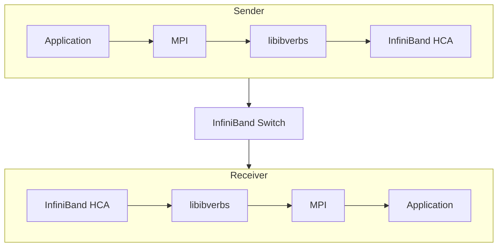

🔍 **OpenSM configures the network. MPI uses the network.**

> In the previous post, we learned that OpenSM is responsible for discovering an InfiniBand fabric, assigning Local IDs (LIDs), configuring routes, and bringing the subnet online.
>
> But OpenSM itself never transfers application data.
> The actual communication is performed by MPI over the network that OpenSM has already configured.

---

## ① Where Does MPI Fit?

A common misconception is that OpenSM participates in every communication. It does not. Once the subnet has been initialized, OpenSM becomes mostly idle unless the network topology changes. Application traffic flows directly between HCAs.


OpenSM's job finished before the first MPI message was even sent.

---

## ② Responsibilities

Each software component has a different responsibility.

| Component         | Responsibility                                          |
| ----------------- | ------------------------------------------------------- |
| OpenSM            | Discover subnet, assign LIDs, compute routes            |
| HCA               | Execute RDMA operations and transport packets           |
| InfiniBand Switch | Forward packets according to forwarding tables          |
| MPI               | Provide distributed communication APIs for applications |

OpenSM `prepares` the network.
MPI `uses` the prepared network.

---

## ③ What Happens During MPI_Send?

Suppose an application executes:

```cpp
MPI_Send(buffer, count, MPI_FLOAT, 1, 0, MPI_COMM_WORLD);
```

Internally, several layers become involved.



Notice that OpenSM is not part of the communication path. Its configuration has already been applied to every switch and HCA.

---

## ④ Why Does MPI Need OpenSM?

Without OpenSM, an InfiniBand subnet cannot become operational.
The HCAs initially have no valid addresses.
The switches have no forwarding tables.
There are no routes between nodes.

Therefore:


OpenSM initializes the fabric before MPI starts exchanging messages.

---

## ⑤ Does OpenSM Handle Every Packet?

No.

After initialization:

* OpenSM is not involved in packet forwarding.
* MPI traffic bypasses OpenSM completely.
* Switch ASICs forward packets entirely in hardware.
* HCAs perform RDMA directly.

This separation is one of the reasons InfiniBand achieves extremely low latency.

---

## Summary

OpenSM and MPI complement each other but serve different purposes.

* OpenSM manages the network.
* MPI manages distributed communication.
* HCAs execute RDMA.
* Switches forward packets in hardware.

Understanding this distinction is essential before exploring RDMA verbs and queue pairs.

In the next post, we'll dive into the InfiniBand Verbs API, where MPI eventually reaches the hardware through Queue Pairs (QPs), Completion Queues (CQs), and Work Queue Elements (WQEs).
