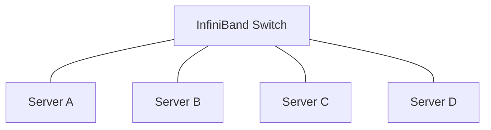
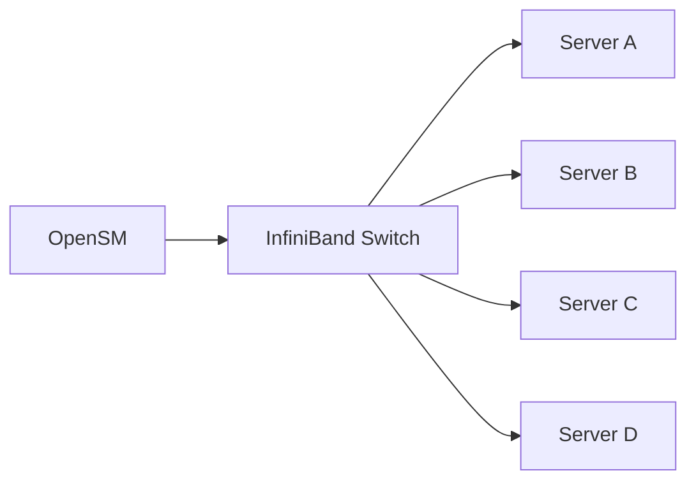
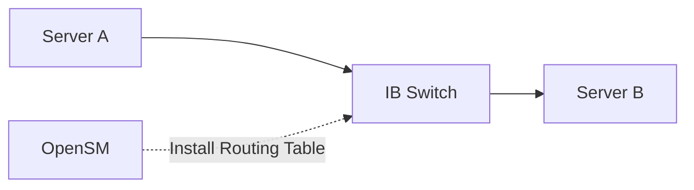
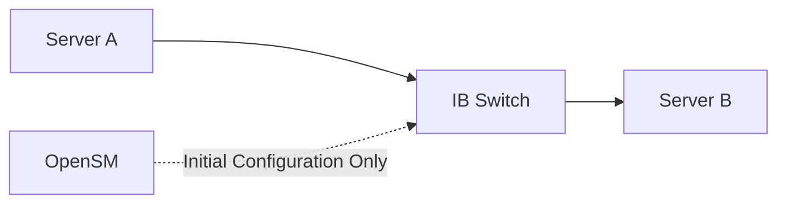

When people first encounter **InfiniBand**, they often assume it behaves like Ethernet. With Ethernet, connecting two hosts through a switch is usually enough for communication to begin immediately. InfiniBand is different. Even if every cable is connected correctly, hosts cannot communicate until another component initializes the fabric.

That component is **OpenSM**.

---

## ① Why Doesn't InfiniBand Work Immediately?

Imagine connecting four servers to an InfiniBand switch.

Every cable is plugged in.
The switch powers on.
The network adapters are detected by the operating system.

Yet no RDMA communication is possible.
Unlike Ethernet, InfiniBand requires the entire fabric to be initialized before packets can be forwarded.

Someone must answer questions such as:
* Which `identifier` should each port use?
* Which `route` should packets follow?
* Which `path` is optimal?
* Which `links` are currently active?

Without these answers, the network exists physically but not logically.

---

## ② The Role of OpenSM

OpenSM is the **Subnet Manager (SM)** implementation provided by NVIDIA. Its responsibility is not to transfer application data. Instead, it discovers the InfiniBand fabric and configures it so every device knows how to communicate.

A simplified initialization process looks like this.

Once OpenSM starts, it discovers every Host Channel Adapter (HCA), switch, and port connected to the subnet.

---

## ③ What Does OpenSM Configure?

OpenSM performs several management tasks before applications can exchange data.

### Assigning Local IDs (LIDs)

Every InfiniBand port receives a **Local Identifier (LID)**. A LID functions similarly to an address inside the subnet. Without LIDs, switches cannot determine where packets should be forwarded.

---

### Building Routing Tables

After discovering the topology, OpenSM computes forwarding paths for every destination. These routing entries are then programmed into each InfiniBand switch.

Unlike Ethernet, where switches gradually learn MAC addresses from traffic, InfiniBand routing is established proactively by the Subnet Manager.

---

### Monitoring Fabric Changes

The fabric is not static.

A server may reboot.
A cable may be disconnected.
A new node may be added to the cluster.

Whenever the topology changes, OpenSM detects the event and updates routing information accordingly. This allows the subnet to remain consistent without requiring manual configuration.

---

## ④ What OpenSM Does **Not** Do

A common misconception is that OpenSM participates in every RDMA communication. It does not.After initialization completes, data flows directly between endpoints.

The data path does **not** pass through OpenSM.

Instead, OpenSM only manages the control plane of the InfiniBand fabric.

This distinction is important:

* **OpenSM manages the network.**
* **Applications use the network.**

Once routing information has been installed, the switch forwards packets independently.

---

## ⑤ Why Is OpenSM Considered the Control Plane?

One useful way to think about OpenSM is to compare it with a city traffic system.

Imagine a newly built city.

Before vehicles can move efficiently, someone must

* assign street names,
* install road signs,
* determine intersections,
* and configure traffic signals.

Only after that preparation can cars begin driving. OpenSM plays a similar role for InfiniBand. It prepares the network but does not participate in every packet transmitted afterward.

---

## ⑥ Lessons Learned

OpenSM is often overlooked because it rarely appears in application code. However, every RDMA application running on InfiniBand depends on it.

Without a Subnet Manager,

* ports cannot obtain `LIDs`,
* switches cannot build `forwarding tables`,
* and the InfiniBand fabric cannot `become operational`.

Although OpenSM never appears in the application data path, it is the component that transforms a collection of cables and switches into a functioning InfiniBand network.

---

## TL;DR

* InfiniBand does not function immediately after devices are connected.
* OpenSM initializes the InfiniBand subnet before communication begins.
* It assigns LIDs, discovers topology, and programs routing tables into switches.
* OpenSM is part of the control plane, not the data plane.
* Once initialization finishes, RDMA traffic bypasses OpenSM and flows directly between endpoints.
